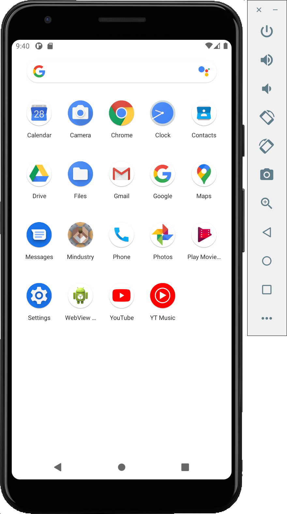

## Android

1. On your local machine, install [Android Studio](https://developer.android.com/studio).
1. Install the SDK.
   
1. [Create and start a device.](https://developer.android.com/studio/run/managing-avds)
   
1. Set the installation path of your Android SDK to the environment variable `ANDROID_SDK_PATH`.
   On MacOS, it's `~/Library/Android/sdk`.
   
1. Start the Android Debug Server on port 5555.
   `$ANDROID_SDK_PATH/platform-tools/adb tcpip 5555`.
1. Forward your Android Debug Server remotely.
   `ssh -R 5555:127.0.0.1:5555 coder.<env name>`
1. On your Coder environment, install the Android SDK.
   Optionally, extend our base image [`codercom/enterprise-android`](https://github.com/cdr/enterprise-images/blob/master/images/android/Dockerfile.ubuntu).
1. Run `adb devices` to view emulators forwarded from your local machine.
1. Build and run your Android applications remotely. For example, `./gradlew android:installDebug`.

