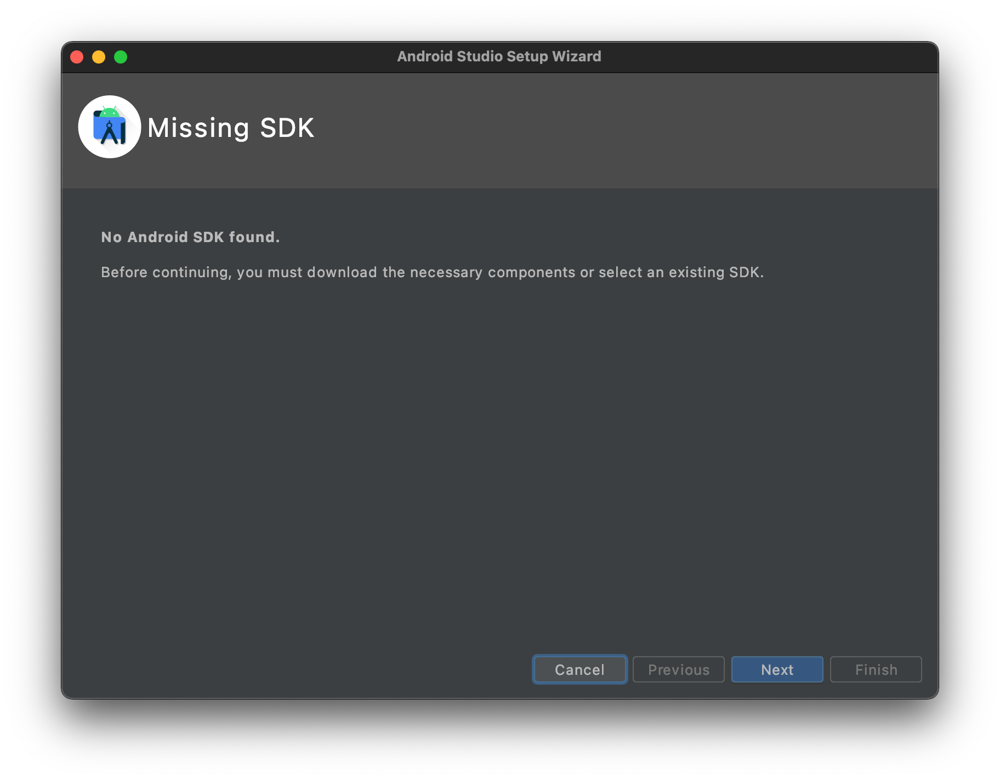
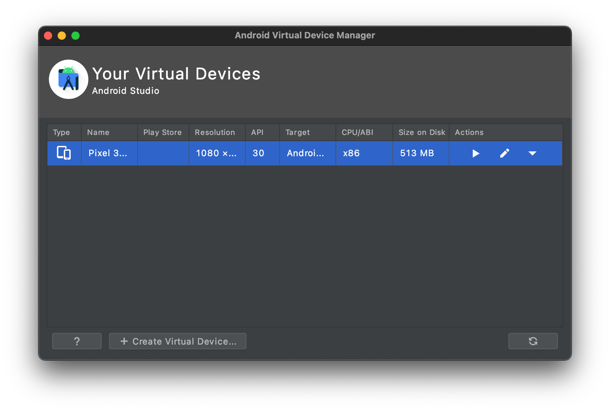
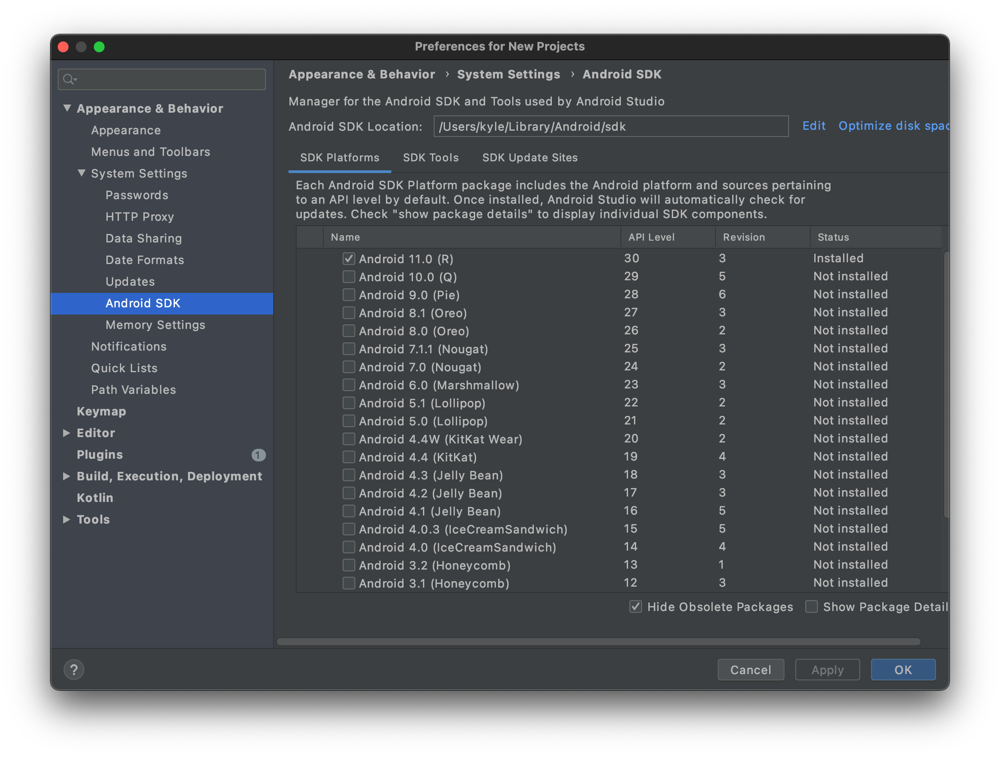

Mobile applications frequently require intensive workloads to achieve fast compilations.
With Coder, you can save time compiling while getting a native emulator experience.

## Android

1. On your local machine, install [Android Studio](https://developer.android.com/studio).

   ```sh
   brew install android-studio
   ```

1. Install the SDK.
   
1. [Create and start a device.](https://developer.android.com/studio/run/managing-avds)
   
1. Set the installation path of your Android SDK to the environment variable `ANDROID_SDK_PATH`.
   On MacOS, it's `~/Library/Android/sdk`.
   
1. Start the Android Debug Server on port 5555.

   ```bash
   $ $ANDROID_SDK_PATH/platform-tools/adb tcpip 5555
   restarting in TCP mode port: 5555
   ```

1. Create a Coder environment with the Android SDK.
   Optionally, import or extend [our image](https://github.com/cdr/enterprise-images/blob/master/images/android/Dockerfile.ubuntu).

   ```dockerfile
   FROM codercom/enterprise-android
   ```

1. Forward your Android Debug Server remotely.

   ```bash
   # You must have the Coder CLI installed.
   $ coder config-ssh
   $ ssh -R 5555:127.0.0.1:5555 coder.<env name>
   ```

1. Run `adb devices` to view emulators forwarded from your local machine.

   ```bash
   $ adb devices
   List of devices attached
   emulator-5556
   ```

1. Build and run your Android applications remotely.

   ```bash
   ./gradlew android:installDebug
   ```
