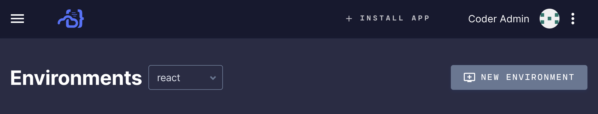
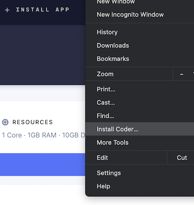
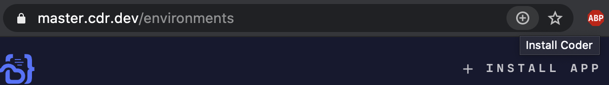
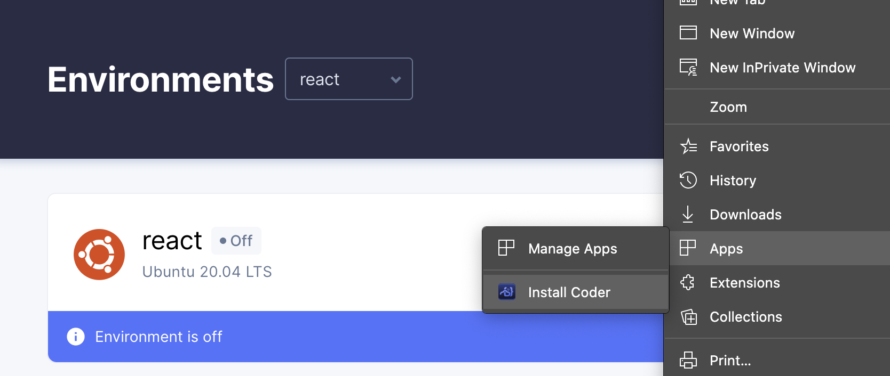

In addition to running Coder Enterprise in a web browser, you can also run it as
a progressive web application (PWA). Using Coder Enterprise as a PWA offers you
an experience that is akin to a native application and offers improved
performance.

## Requirements

To use Coder Enterprise as a PWA, you must be using Google Chrome or Microsoft
Edge.

> You must be logged in to Coder Enterprise using either Chrome or Edge before
> proceeding with any of the following installation steps.

## Chrome Installation

You can install Coder Enterprise as a PWA when using Chrome in one of three
ways.

### Option 1 for Chrome

Click **Install App**, which is located at the top of the Coder Dashboard.

### Option 2 for Chrome

Go to your **Settings** menu and select **Install Coder**.

### Option 3 for Chrome

Click the **plus** icon located in the browser's URL bar.

### Uninstalling the Chrome Progressive Web App

To remove the Coder Enterprise progressive web app at any time, go to
**Settings** > **Uninstall Coder**. You'll be prompted to remove Coder; confirm
by clicking **Remove**. You can also check the box to clear Coder data if
desired.

## Edge Installation

You can install Coder Enterprise as a PWA when using Edge in one of three ways.

### Option 1 for Edge

Click **Install App**, which is located at the top of the Coder Dashboard.

### Option 2 for Edge

Click the **plus** icon located in the browser's URL bar.

### Option 3 for Edge

Go to Settings > Apps and select **Install Coder**.

### Uninstalling the Edge Progressive Web App

To remove the Coder Enterprise progressive web app, go to **Settings** >
**Uninstall Coder**. You'll be prompted to remove Coder; confirm by clicking
**Remove**. You can also check the box to clear Coder data (if desired).
