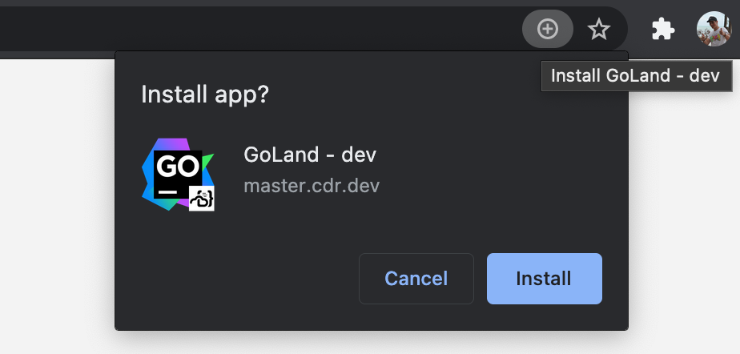

To preserve the _native feel_ through the browser, Coder provides a PWA for each editor.

> You must be using Google Chrome or Microsoft Edge.

Launch into the editor of your choice, and click the install button in the top-right of the URL bar.

