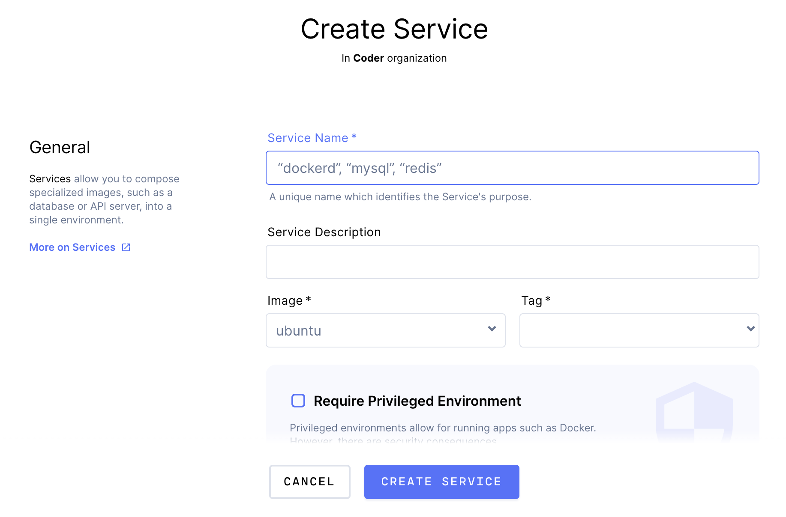

Coder allows you to add **services**, which are "sidecar" containers that run
alongside your primary development environment.

## Before You Proceed

Creating a service is similar to [importing images](../images/importing.md) into
Coder. Before proceeding, be sure that Coder can access a
[registry](../admin/registries/index.md) and pull images from that registry.

## Adding a Service

> Configuring a service makes it available to all users in your org, though each
> user gets their own instance of the service.

To add a new service, go to **Services** in the top navigation bar and click
**New Service**.

You'll be asked to provide the following basic information:

* **Service Name**: The name for your service
* **Service Description**: (Optional) A description of what your service is/what
  it does:
* **Image**: The image to be pulled
* **Tag**: The specific image you want to be pulled

If your service requires a privileged container, check the **Require Privileged
Environment** box.

Click **Create** to proceed, though you may want to set overrides, create
environment variables, or set your volume mounts at this time.

### Overrides

If you want to override the default way to start your image, provide the
**Dockerfile entrypoint** desired. You can also provide as many **command
arguments** as necessary to the entry point.

### Environment Variables

You can create environment variables that are injected into the service's
container.

Environment variables can change your application's behavior or be used to store
the information you don't want to be saved in the image (e.g., database URIs).

To create an environment variable, provide the name you want to be used as the
**key** and the **value** you want to store with the key. You can create as many
variables as you'd like.

### Volume Mounts

If you would like your service to create a storage directory that persists
through rebuilds, you can define the volume used here. Provide:

* A **name** for the volume
* The **path** to the volume
* The **size** the volume should be

Please note that the service will have access to the home volume of the primary
container.
