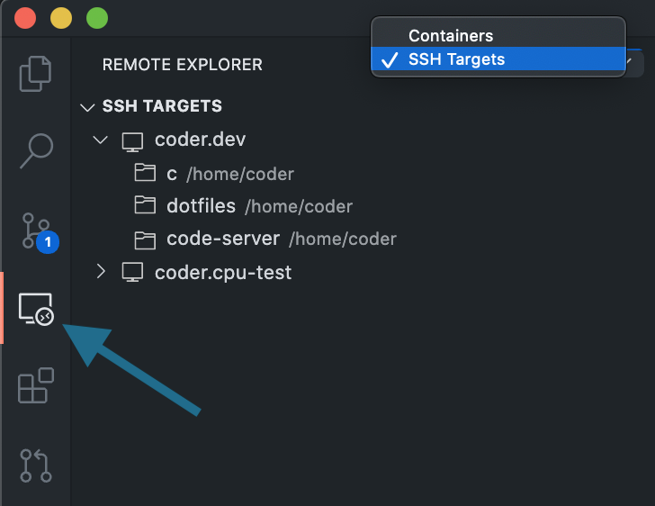

Before using, configuring, and accessing your environment via SSH:

- Your site manager must *not* have [disabled
  access](../admin/environment-management/ssh-access.md) via SSH
- You must have the [Coder CLI](../cli/index.md) installed on your local
  machine before proceeding.

## Configuration

You can access your environments via SSH by configuring your local machine as
follows:

```bash
$ coder config-ssh

An auto-generated ssh config was written to "/Users/yourName/.ssh/config"
Your private ssh key was written to "/Users/yourName/.ssh/coder_enterprise"
You should now be able to ssh into your environment
For example, try running
    $ ssh coder.backend
```

Your environment is now accessible via `ssh coder.<environment_name>` (e.g.,
`ssh coder.myEnv` if your environment is named `myEnv`).

## Accessing Coder Enterprise via VS Code

Once you've set up SSH access to Coder Enterprise, you can work on projects
locally using VS Code, then connect to a predefined environment for compute,
etc.

1. Open VS Code locally.
2. Make sure that you've installed [Remote -
   SSH](https://marketplace.visualstudio.com/items?itemName=ms-vscode-remote.remote-ssh)
3. In VS Code's left-hand nav bar, click **Remote Explorer**.



4. Ensure you're viewing **SSH Targets** and click **+** to add a new host. In
   the prompt that appears, select your alias for Coder Enterprise (e.g.,
   `coder.<environment_name>`).

VS Code will open a new window connected to your remote container, allowing you
to add your folder(s) and continue working.

## Reconfiguration

You will need to rerun the `coder config-ssh` command if:

- You reconfigure or modify their keypair using the Coder dashboard
- You add additional environments (running this command will ensure that your
  **~/.ssh/config** file populates properly)

## Using SFTP

Coder Enterprise supports the use of the SFTP protocol. To connect to an
environment using SFTP, run `sftp coder.<environment_name>`.
