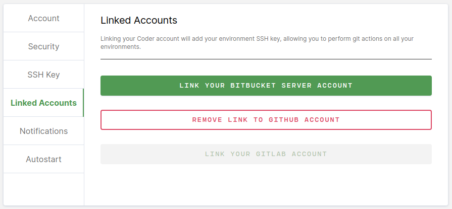
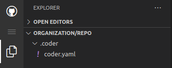

## 0. Configure Git Integration

Before Environments as Code can be used, a [Git Integration](../../admin/git.md) must be configured by a site admin.

Developers must [link](../preferences.md#linked-accounts) their accounts to the Git Integration in the user preferences section. 




## 1. Creating the YAML Configuration Document

Coder can build an environment by reading the configuration from a YAML file, called a **template**. This template file can fully customize an environment beyond the simple [web form](../getting-started.md#2-create-an-environment). The YAML document must follow the [Environments as Code Specification](specification.md). The specification also details more advanced configuration options. 

A very basic configuration file will look like this:

```yaml
# A very basic coder.yaml configuration file.
version: 0.0
workspace:
  name: "wacky-env"
  type: "kubernetes"
  spec:
    # This image must already be imported into your organization
    image: index.docker.io/library/ubuntu
    container-based-vm: true
    cpu: 1
    memory: 2
    disk: 15
```

### Fields


<table>
    <thead>
        <tr>
            <td><b>Field</b></td>
            <td><b>Description</b></td>
        </tr>
    </thead>
    <tbody>
        <tr>
            <td>version</td>
            <td>semver version string. Currently only '0.0' is supported.</td>
        </tr>
        <tr>
            <td>workspace</td>
            <td>This section handles all Environment configuration options. Anything in this section will directly make modifications to an Environment</td>
        </tr>
        <tr>
            <td>workspace->name</td>
            <td>The name of the Coder Environment. This name can only be used once per user.</td>
        </tr>
        <tr>
            <td>workspace->type</td>
            <td>This field determines which fields are supported in 'spec'. This field indicates which provider type is being used. Currently only 'kubernetes' Environments are supported.</td>
        </tr>
        <tr>
            <td>workspace->spec</td>
            <td>This section configures the resource provisioning options.</td>
        </tr>
    </tbody>
</table>

### Common Issues

When using an Environments as Code template file for the first time, there is likely a few common issues you will encounter.

#### 400 Image not found

If this error is encountered, ensure the image is [imported](../../images/importing.md). Specifying the full image uri is also recommended.

```text
The image was not found in the registered images. Please add the image to Coder.
```

#### 409 Environment with that name already exists

Environment names must be unique per user. At this time, the name in the template is static, therefore only 1 environment per user can be configured for each YAML document. If you receive this error, you may delete your old environment with that name or change the `name` section in the YAML document.

```text
An environment with that name already exists for the user.
```

## 2. Uploading the Configuration to Git

The YAML document should live inside a version controlled repository. By default, this YAML document should be placed at `.coder/coder.yaml`. The git repository should be accessible via the Git Integration already configured. When the `coder.yaml` is updated via a commit, all Environments using this repository's YAML document will be notified of the update. Rebuilding an Environment will update the existing environment to the latest configuration options.



## 3. TODO: Instruct how to use the UI to choose the git repo we just setup

TODO: CLI docs too?