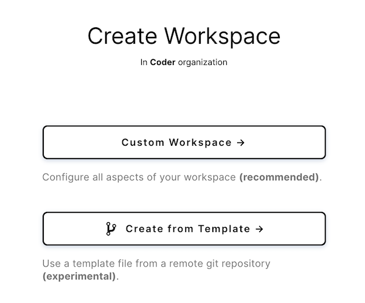
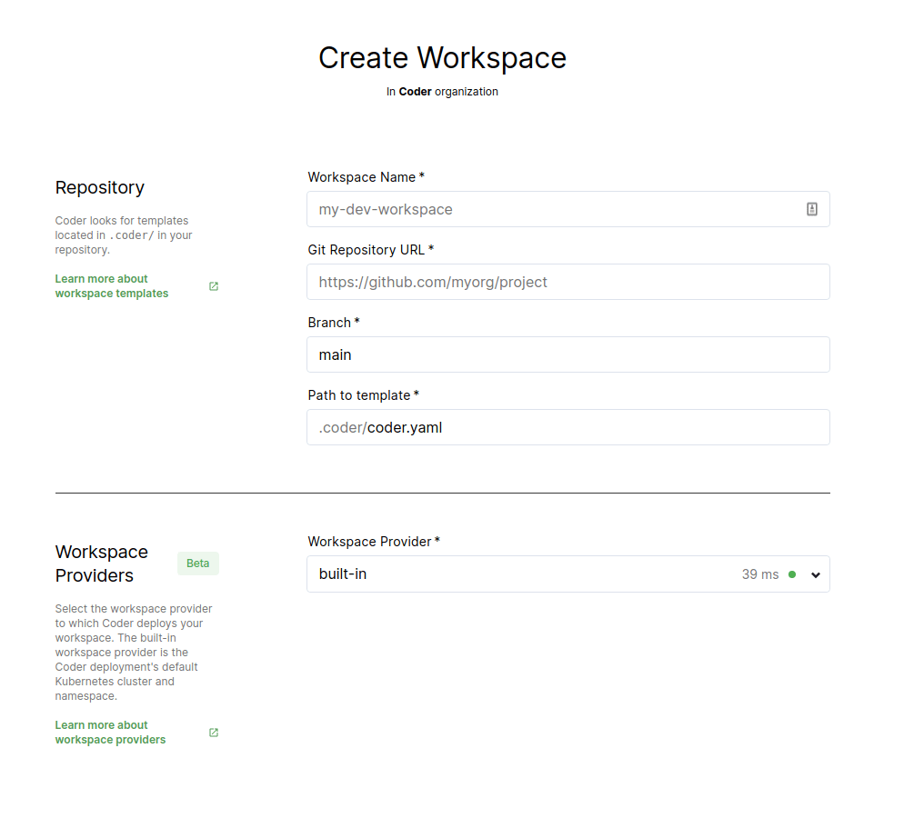

Workspaces as code (WAC) brings the _infrastructure as code_ paradigm to Coder
environments. WAC allows you to define and create new environments using
**workspace templates**.

[Workspace templates](./templates.md) are declarative YAML files that describe
how to configure environments and their supporting infrastructure.

## Requirements

- You must configure a
  [Git OAuth service of your choice](../../admin/git.md)
- The image you use in your template **must** have been
  [imported](../../images/importing.md) into Coder
- A `.coder/coder.yaml` file exists in your repository.

## Creating a workspace template

You can find a fully populated workspace template and descriptions of each field
in our [syntax guide](templates.md).

## Creating a workspace using a template

To create a new workspace using a template, go to **New Workspace** > **Create
from Template**.

When prompted, provide:

- **Workspace Name**: A friendly name for your workspace
- **Git Repository URL**: The git repository that contains your `coder.yaml`
  configuration file. See [Workspace templates](templates.md) for more
  information about these files
- **Branch**: The branch in your git repo to track
- **Path to template**: The path to your workspace template. By default, this
  will be `.coder/coder.yaml`, but if you choose a different path, provide it
  here

## Adding an embeddable button

To make it easy for your developers to use your template, you can generate an
embeddable Markdown button for use in your repo. See the
[admin guide](../../admin/templates.md) for details.
