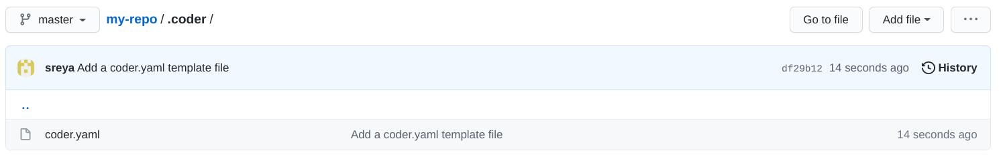

Workspaces as code (WAC) allows you to define and create new environments using
**workspace templates**.

Workspace templates are written as YAML and have a `.yaml` or `.yml` extension.
Coder looks for your workspace template at the following path:

```text
<repository-root>/.coder/coder.yaml
```



## Workspace template sample

The following is a sample workspace template that makes use of all available
fields. Depending on your use case, you may not need all of the options
available.

For detailed information on the fields available, see the
[subsequent sections](#workspace-template-fields) of this article

```yaml
version: 0.1
workspace:
  type: kubernetes
  spec:
    image: index.docker.io/ubuntu:18.04
    container-based-vm: true
    cpu: 4
    memory: 16
    disk: 128
    gpuCount: 1
    labels:
      com.coder.custom.hello: "hello"
      com.coder.custom.world: "world"
  configure:
    start:
      - name: "install curl"
        command: |
          apt update
          apt install -y curl
      - name: "install Go binary"
        command: "go install"
        directory: /home/coder/go/src/github.com/my-project
        shell: "bash"
        env:
          GOPATH: /home/coder/go
```

## Workspace template fields

### version

The version number of the config file being used. The current version is `0.1`.

### workspace

**Required**. The section containing all configuration information related to
the environment.

#### workspace.type

**Required**. Determines the type of workspace to be created. Currently, the
only accepted value is `kubernetes`.

#### workspace.spec

**Required**. This section contains configuration information specific to the
`workspace.type`.

#### workspace.spec.image

**Required**. The image to use for the environment. The image should include the
registry and (optionally) the tag, i.e. `docker.io/ubuntu:18.04`. If you omit
the tag, Coder uses the default value of `latest`.

You must have [imported the image](../../images/importing.md) into Coder,
otherwise the environment will fail to build.

#### workspace.spec.labels

The
[Kubernetes labels](https://kubernetes.io/docs/concepts/overview/working-with-objects/labels/)
to be added to the environment pod.

```yaml
workspace:
  labels:
    com.coder.custom.hello: hello
    com.coder.custom.world: world
```

#### workspace.spec.gpucount

The number of GPUs to allocate to the environment.

#### workspace.spec.container-based-vm

Determines whether the environment should be created as a
[container-based virtual machine (CVM)](../cvms.md). Default is `false`.

#### workspace.spec.cpu

**Required**. The number of cores to allocate to the environment.

#### workspace.spec.memory

**Required**. The amount of memory (in GB) to allocate to the environment.

#### workspace.spec.disk

**Required**. The amount of disk space (in GB) to allocate to the environment.

#### workspace.configure

This section lists the commands that run within the environment after Coder
builds the environment. See [Configure](../../images/configure.md) for more
information.

#### workspace.configure.start

The list of commands to run when Coder _starts_ an environment.

#### workspace.configure.start[*].command

**Required**. Runs the provided command within the environment (Coder supports
the use of both single-line and multi-line commands).

- Single-line command:

  ```yaml
  - name: Install curl
    command: apt install -y curl
  ```

- Multi-line command:

  ```yaml
  - name: Update and install curl
    command: |
      apt update
      apt install -y curl
  ```

#### workspace.configure.start[*].name

The name of the command being run.

#### workspace.configure.start[*].shell

The shell Coder should use to run the command.

```yaml
start:
  - name: First step
    shell: /bin/bash
```

#### workspace.configure.start[*].directory

The working directory from which Coder should run the command.

```yaml
start:
  - name: First step
    directory: /home/coder
```

#### workspace.configure.start[*].env

The map of environment variables to set for the command.

```yaml
start:
  - name: First step
    env:
      HOME: /home/coder
      GOPATH: /home/coder/go
```

#### workspace.devURLs

This lists allows provisioning of dev urls from the workspaces as code configuration file. These urls will be provisioned in addition to any user created dev urls. See [Dev URLs](../devurls.md) for more information.

#### workspace.devURLs[*].name

The friendly name for the dev url.

#### workspace.devURLs[*].port

The port on the workspace to expose via this url.

#### workspace.devURLs[*].scheme

Url scheme being `http` or `https`.

#### workspace.devURLs[*].access

Set the visibility of the dev url.

- `private` - Only the owner of the workspace can access.
- `org` - All members of the organization the workspace is in can access.
- `authed` - All users on the same coder deployment can access.
- `public` - Anyone on the internet can access.