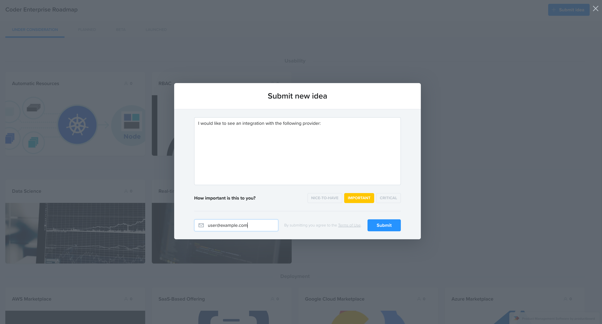
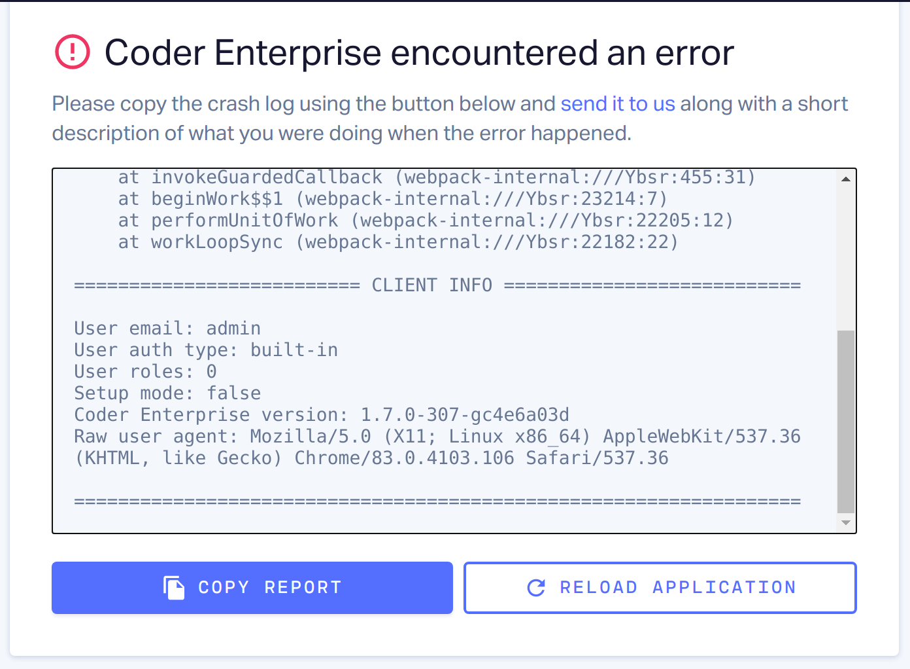
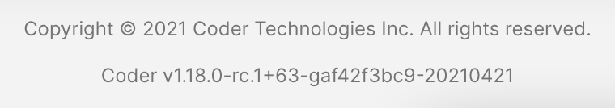

Do you have a feature request or an idea for how we can improve our product? Is
something not working as expected? **We want to hear from you!**

## Making a suggestion

Check our [roadmap](https://roadmap.coder.com/) to see if the suggested feature
exists. You can vote for features and provide more detailed suggestions.

If you can't find the feature, select **Submit Idea** then fill out the form
with the details of your suggestion.

We collect your email so that you will be notified when the feature is updated.



## Reporting a problem

If you experience a problem or encounter unexpected behavior, send a detailed
report using the guidelines below to **support@coder.com**. If the application
crashes, Coder generates a report for you. Copy the report and include it with
your message.



### Writing a detailed report

Writing a detailed report improves our ability to address any issues you see or
concerns that you may have. We suggest including the following information when
writing your report:

```md
**Steps to reproduce:**

1. Step 1
2. Step 2
3. Step 3

**Expected:**

Describe what you expected to happen

**Actual:**

Describe what happened

**System information:**

- Operating System:
- Browser:
- Console logs:
```

We welcome any additional information that you think may be helpful.

### Coder version information

One critical piece of information you could provide is the version number of
your deployment. This information is available at the bottom of most pages in
the Coder UI.


