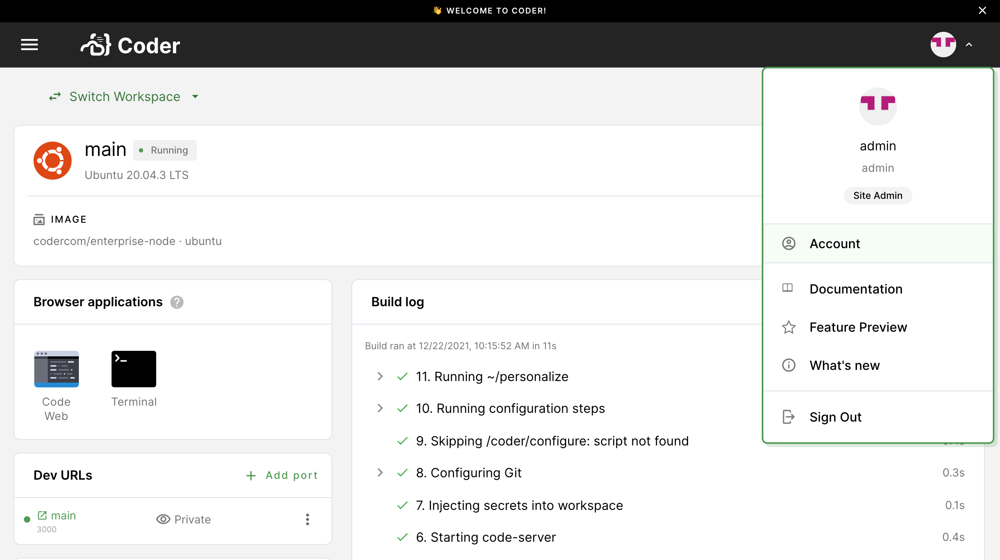
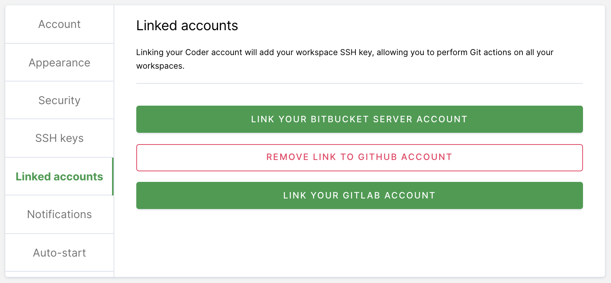
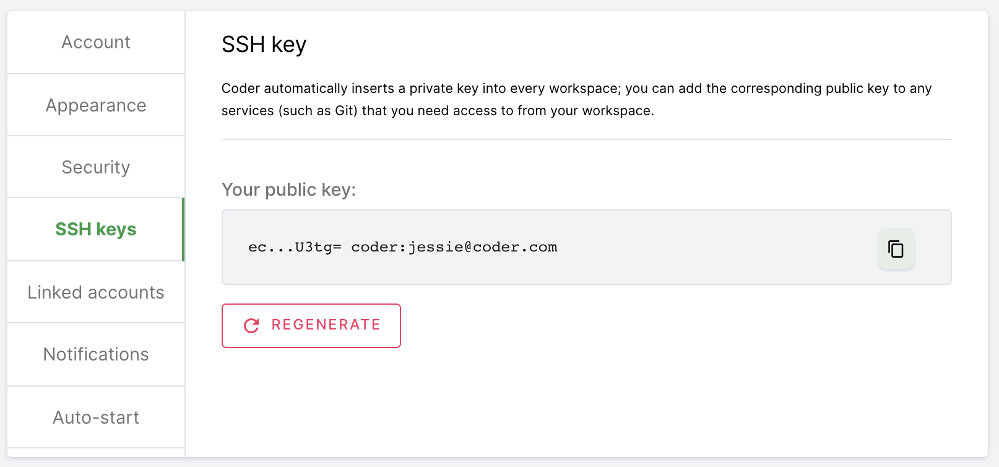
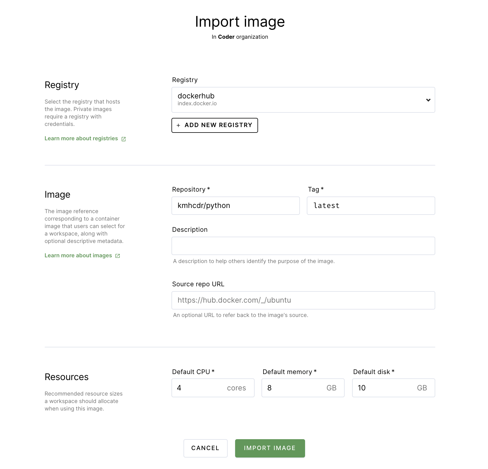
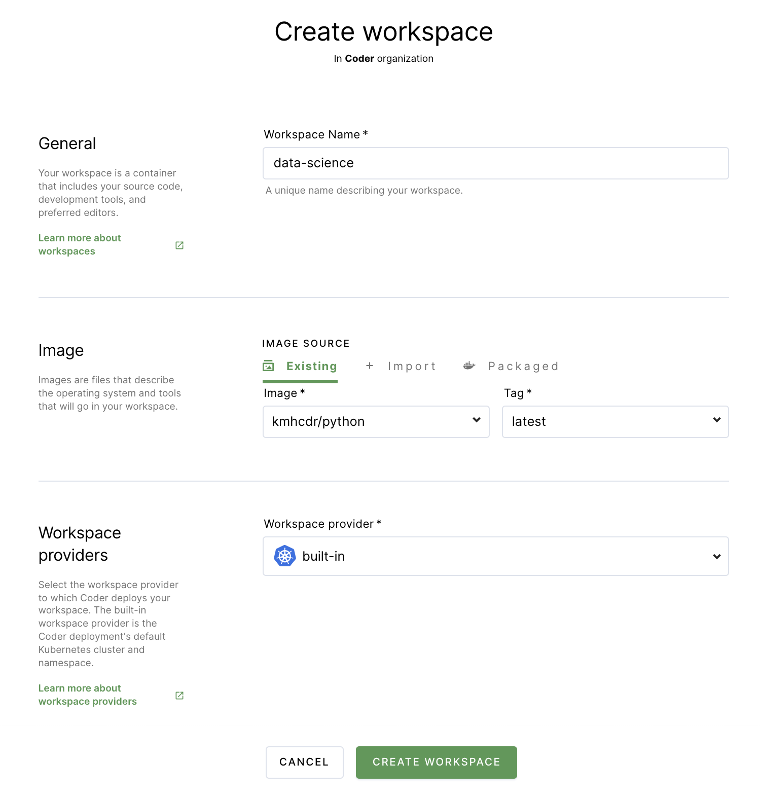
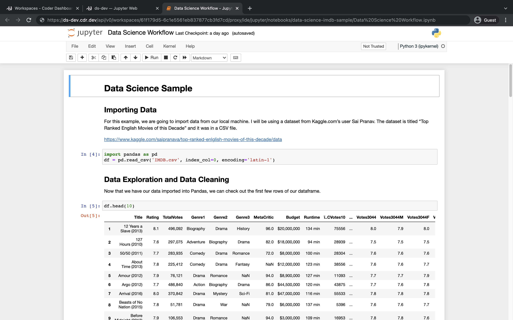

# Data scientists

This article will walk you through the process of getting started with a Coder
workspace capable of supporting data science projects. You'll learn how to:

- Connect Coder to your Git provider (this example assumes that you're using
  GitHub, but Coder supports GitLab and Bitbucket as well));
- Create a workspace with Jupyter Notebook and other data science packages
  present;
- Add a sample project to your workspace, specifically
  [one as a Jupyter Notebook using IMDB movie data](https://github.com/khorne3/data-science-imdb-sample).

## Prerequisites

This guide assumes that you have a Coder deployment available to you and that
you have the credentials needed to access the deployment.

## Step 1: Log in and connect Coder to your Git provider

In this step, you'll log into Coder, then link your Coder account with your Git
provider. This will allow you to do things like pull repositories and push
changes.

1. Navigate to the Coder deployment using the URL provided to you by your site
   manager, and log in.

1. Click on your avatar in the top-right, and select **Account**.

   

1. Provide Coder with your SSH key to connect and authenticate to GitHub.

   If your site manager has configured OAuth, go to **Linked Accounts** and
   follow the on-screen instructions to link your GitHub account.

   

   If your site manager has _not_ configured OAuth or you are using a Git
   provider that Coder does not support, go to **SSH keys**. Copy your public
   SSH key and
   [provide it to GitHub](https://docs.github.com/en/authentication/connecting-to-github-with-ssh/adding-a-new-ssh-key-to-your-github-account).

   

## Step 2: Import an image

At this point, you'll import your image, which you can think of as a template
for your workspace. This template contains the language version, tooling, and
dependencies you need to work on the project. In this case, the image also
contains a `configure` script that will clone the data science project from
GitHub to your workspace.

To import an image:

1. In the top navigation bar, click **Images**. Then, click on **Import Image**.

1. Leave the default registry (which is **dockerhub**) selected.

1. Under **repository**, provide **kmhcdr/python**. Provide **latest** as the
   **tag**. Optionally, you can provide a **description** of the image

1. Specify the minimum amount of resources (cores, memory, and disk space) the
   workspace should have when using this image. For this project, we recommend 4
   cores, 8 GB memory, and 10 GB disk space as a starting point.

1. Click **Import Image**.

## Step 3: Create your workspace

You will now create the workspace where you'll work on your development project.

1. Return to **Workspaces** using the top navigation bar.

1. Click **New workspace** to launch the workspace-creation dialog.

1. Provide a **Workspace Name**.

1. In the **Image** section, select the **kmhcdr/python** image you just
   imported.

1. Under **Workspace providers**, leave the default option (which is
   **built-in**) selected.

1. Expand the **Advanced** section. If the **Run as a container-based virtual
   machine** option is selected, _unselect_ the box. Leave the **CPU**,
   **Memory**, **Disk**, and **GPU** allocations as-is.

1. Scroll to the bottom, and click **Create workspace**. The dialog will close,
   allowing you to see the main workspace page. You can track the workspace
   build process using the **Build log** on the right-hand side.

   Due to the number of packages present in the image, this might take few
   minutes.

Once your workspace is ready for use, you'll see a chip that says **Running**
next to the name of your workspace.

## Step 4: Open up the sample project

At this point, you're ready to open up Jupyter to access your notebook.

1. Under **Browser applications**, click **Jupyter** to open the IDE in a new
   browser tab.

1. Under **Files**, click to open the **data-science-imdb-sample** project.

1. Click **Data Science Workflow.ipynb** to launch the notebook.

   You're now ready to proceed with work on the project.

