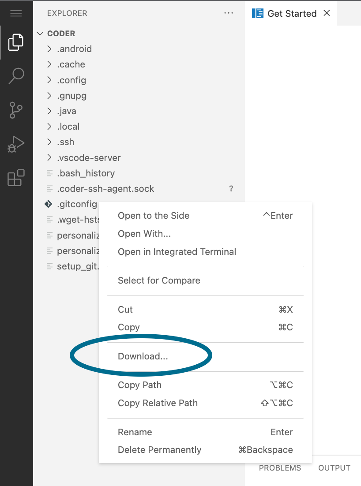

For security and compliance purposes, Coder site managers may choose to disable
the downloading of files from Coder's built-in IDEs:



To do so,
[update your deployment's workspace template policy](../../admin/templates.md)
to include the following definition:

```yaml
kubernetes:
    env:
        policy: append
        value:
        - key: "CS_DISABLE_FILE_DOWNLOADS"
            value: "1"
```

This change will take effect _after_ the user rebuilds their workspaces.
