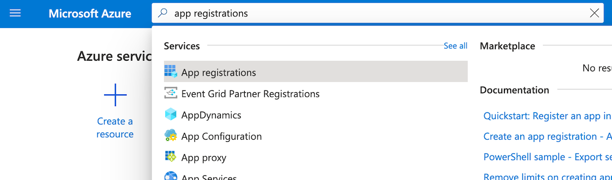
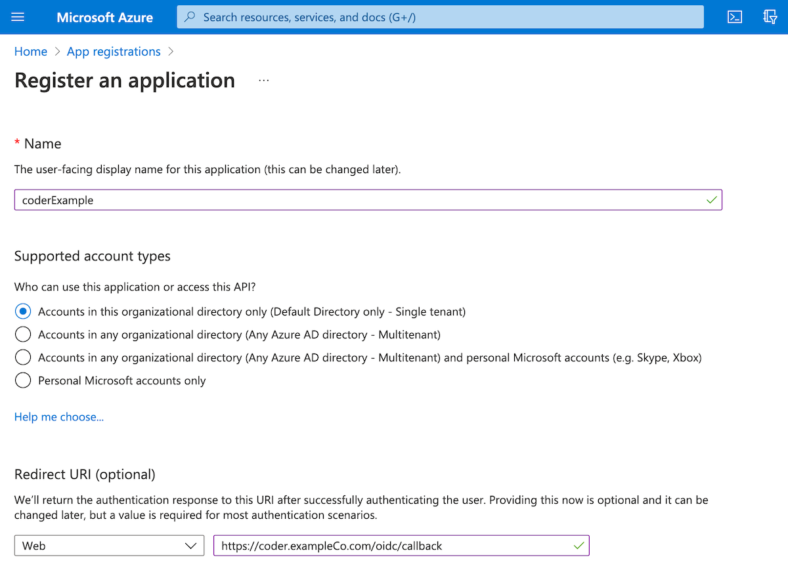
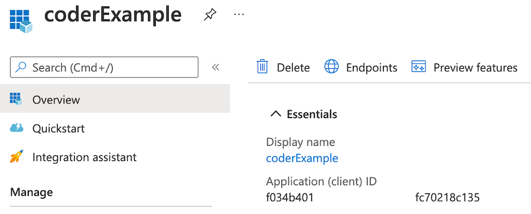
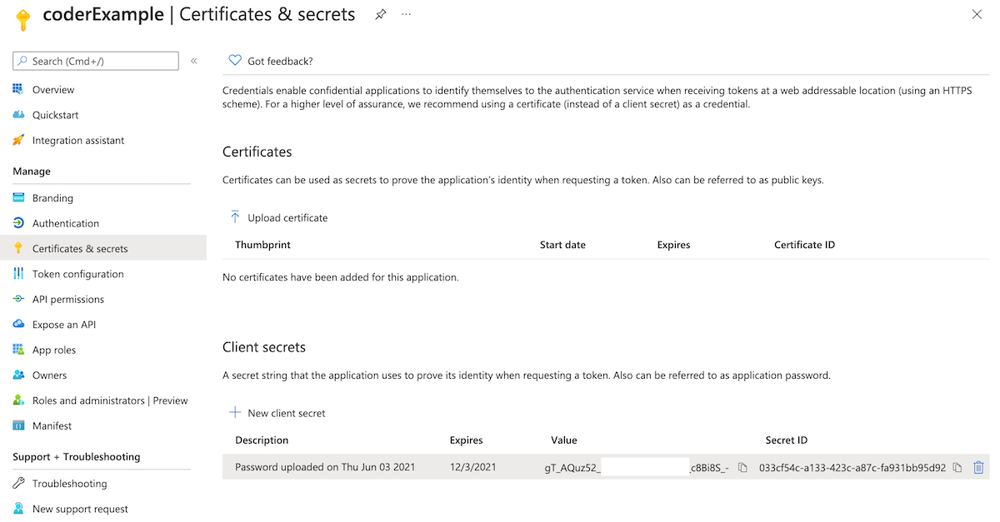
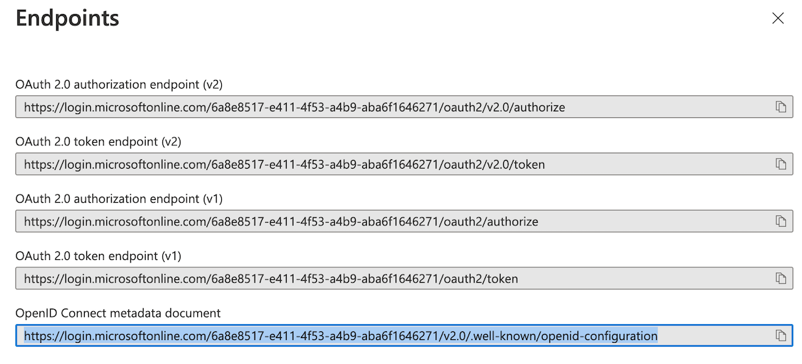

This article walks you through setting up single sign-on to Coder using Azure's
Active directory.

Configuring [Coder's OpenID Connect](../../admin/access-control/index.md#openid-connect)
feature requires you to provide three pieces of information from Azure:

- Client ID
- Client Secret
- Issuer

This guide will show you how to set up Azure's Active Directory and obtain the
information you need to provide to Coder.

## Step 1: Register your app with Azure

1. Log in to [Azure](https://portal.azure.com/).
1. Using the search bar at the top, enter **App registrations** and click the
   matching search result.

   

1. Click **New registration**.
1. Provide a **Name** for your application.
1. Select the access option that best fits your needs; the **Default Directory
   only - Single tenant** option should be sufficient for testing, but you may
   need a **multitenant** option for production environments.

   

1. Provide your **Redirect URL** (it will be formatted similar to
   `https://coder.exampleCo.com/oidc/callback`).
1. Click **Register** to proceed.

When Azure has created your app, you'll be redirected to **Overview**, which
displays the app information.

## Step 2: Gather your Azure app information

Once you've registered your app, you can obtain your:

- Client ID
- Client Secret
- Issuer

### Client ID

On your application's **Overview**, look for the **Application (client) ID**
under the **Essentials** section. This is the value Coder expects as the
**Client ID**.



### Client secret

You'll need to create the client secret. To do so:

1. Go to **Certificates & secrets**.
1. Click **New client secret**.
1. Provide a description for your secret and set an expiration date, and click
   **Add**. (We recommend creating a calendar notification to alert you shortly
   before your secret is set to expire.)
1. You'll be redirected back to the **Certificates & secrets** page; save the
   **Value** field string for use as your client secret.



### Issuer

On your app's **Overview** page, click **Endpoints**. Find **OpenID Connect
metadata document**, and copy the first 2/3s of this value.



For example, if the full value is:

```text
https://login.microsoftonline.com/6a8e8517-e411-4f53-a4b9-aba6f1646271/v2.0/.well-known/openid-configuration
```

Then remove `/.well-known/openid-configuration`, leaving the following as your
issuer:

```text
https://login.microsoftonline.com/6a8e8...6271/v2.0
```

Be sure to keep `v2.0`, though you must omit the `/` from the end.

> If there's an issue during the configuration process, the error message will
> tell you the value you provided and the value it expected; you can use this
> information to correct your configuration.

## Step 3: Configure Coder authentication

Once you've saved your Azure values, you can complete the remaining steps using the
Coder UI.

1. Log in to Coder, and go to **Manage** > **Admin** > **Authentication**.
1. In the top-most drop-down box, select **OpenID Connect**.
1. Provide the requested values for **Client ID**, **Client Secret**, and
   **Issuer**.

When done, click **Save Preferences**.

At this point, Coder validates your configuration before proceeding. If
successful, you can expect Coder to send OIDC login attempts to Azure.
