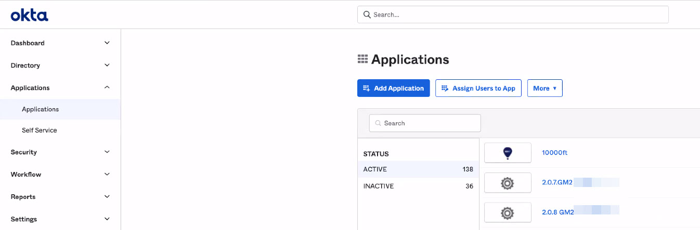
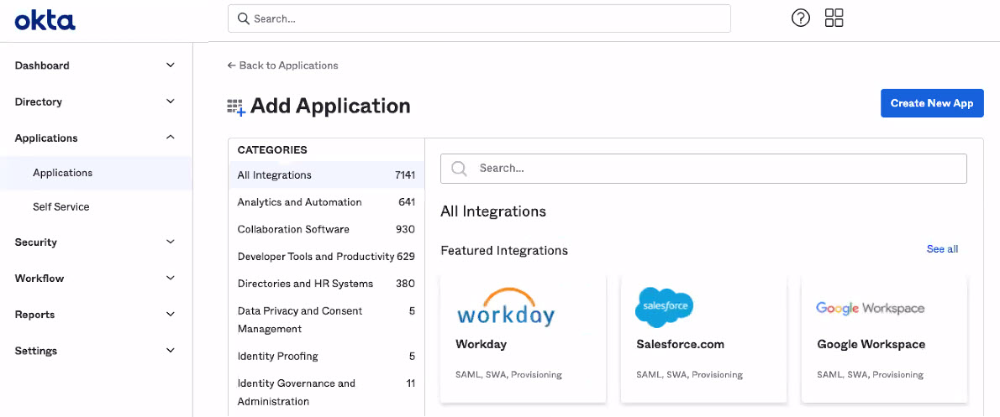
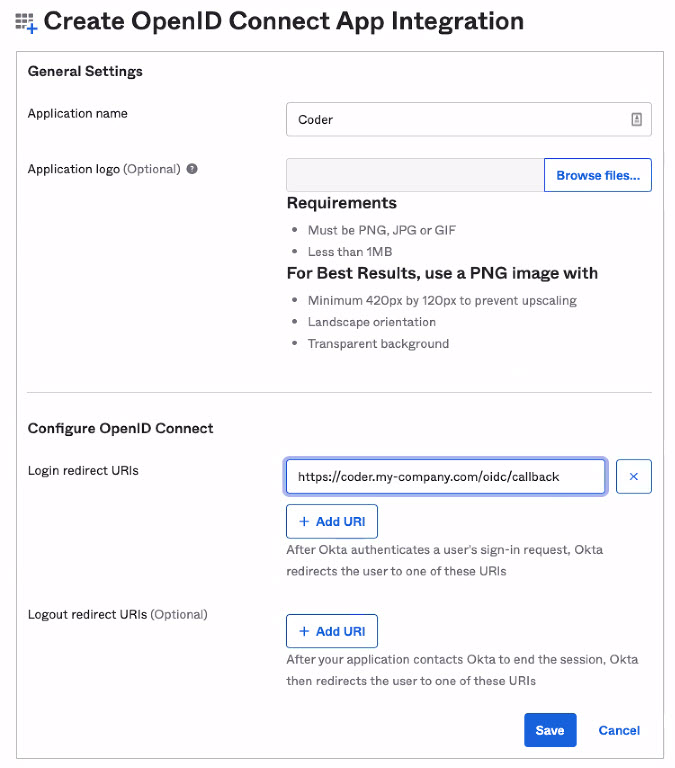
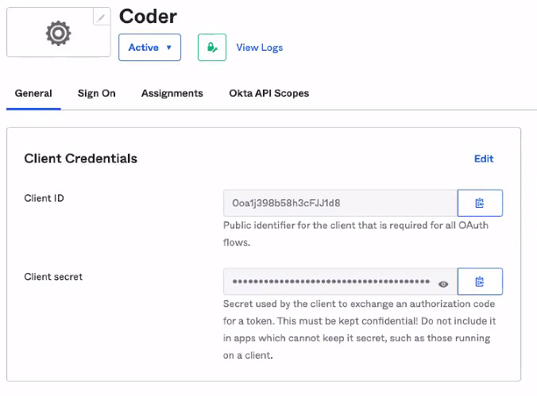
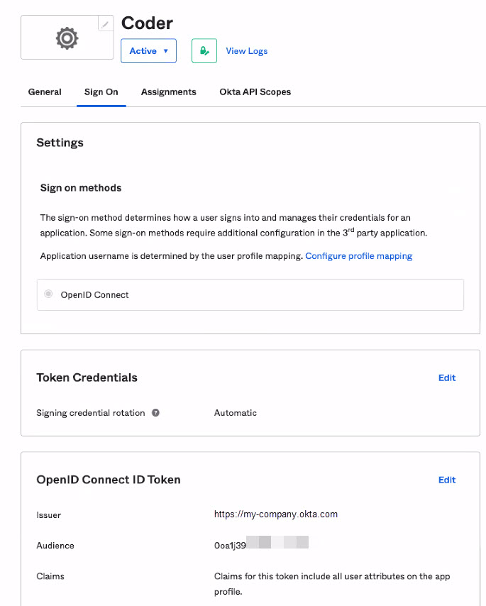
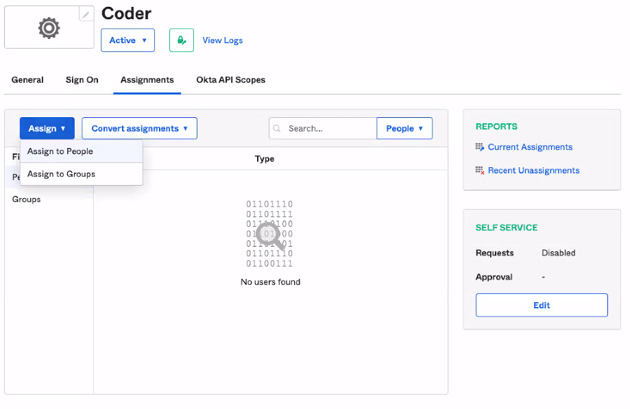

This article walks you through setting up single sign-on to Coder using Okta.

Configuring [Coder's OpenID Connect](../../admin/access-control/index.md#openid-connect)
feature requires you to provide three pieces of information from Okta:

- Client ID
- Client Secret
- Issuer

This guide will show you how to set up an app on Okta and obtain the
information you need to provide to Coder.

## Step 1: Register your app with Okta

1. Log in to your Okta as an admin (`<my-company>.okta.com`).
1. From the admin dashboard, click **Applications** and click the
   **Applications** sub-menu.

   

1. Click **Add Application**.

   

1. Click **Create New App**.

   

1. Select **OpenID Connect** and click **Create**
1. Fill in the **Application name** (i.e. `Coder`), optionally add a logo
1. Add the **Login redirect URIs** for Coder (it will be formatted similar
   to `https://coder.my-company.com/oidc/callback`).
  
   

1. Click **Save** to proceed.

When Okta has created your app, you'll be redirected to the **General** tab,
which displays the app information.

## Step 2: Gather your Okta app information

Once you've saved your app, you can obtain your:

- Client ID
- Client Secret
- Issuer

### Client ID and Client Secret

On your application's **General** tab, look for the **Client ID** under
the **Client Credentials** section. Below this is the **Client secret**.

### Issuer

On your app's **Overview** page, click the **Sign On** tab. Find the
**OpenID Connect ID Token** section, and copy the **Issuer**.

## Step 3: Assign People and/or Groups to Coder

On your app's **Overview** page, click the **Assignments** tab.

From here, you can assign People and Groups to the application to
provide access to Coder.

## Step 4: Configure Coder authentication

Once you've saved your Okta values, you can complete the remaining steps using the
Coder UI.

1. Log in to Coder, and go to **Manage** > **Admin** > **Authentication**.
1. In the top-most drop-down box, select **OpenID Connect**.
1. Provide the requested values for **Client ID**, **Client Secret**, and
   **Issuer**.

When done, click **Save Preferences**.

At this point, Coder validates your configuration before proceeding. If
successful, you can expect Coder to send OIDC login attempts to Okta.
