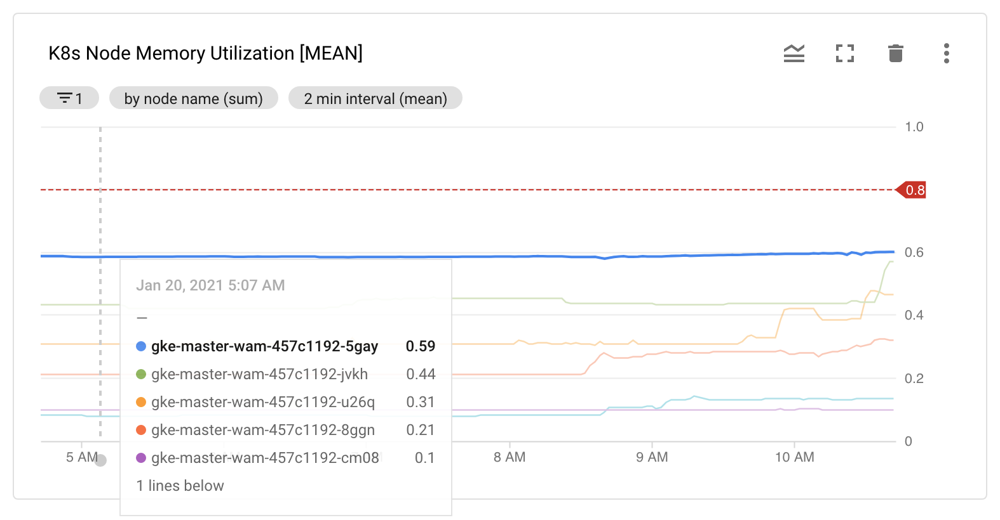
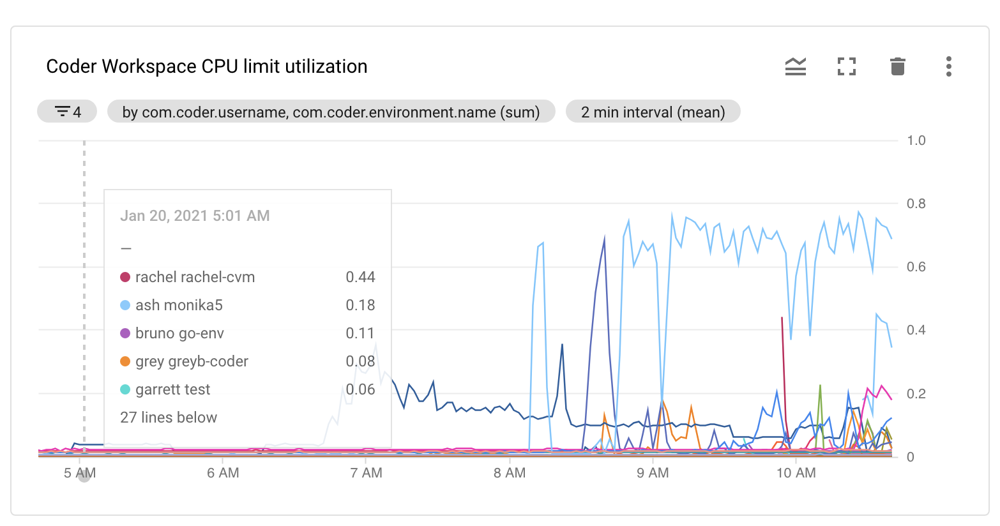
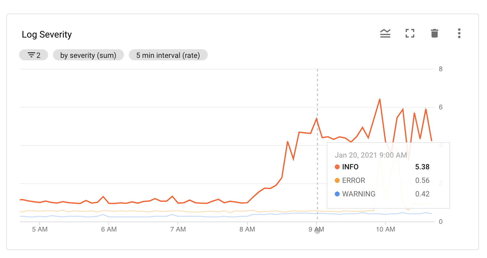
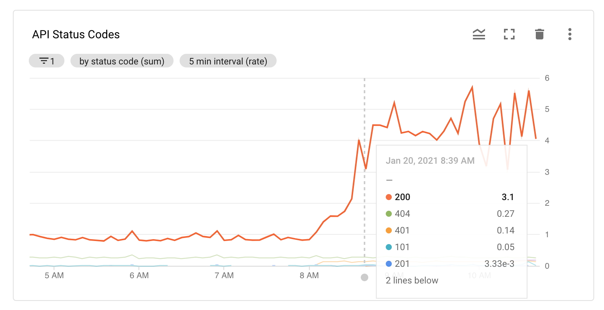
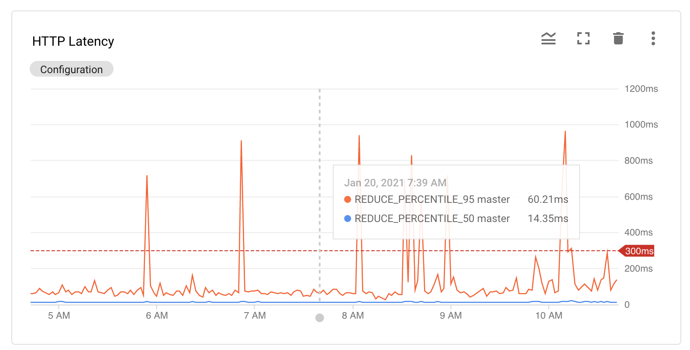

# Usage monitoring

We recommend monitoring your Coder deployment to track compute cost,
performance, uptime, and deployment stability. Because you deploy Coder onto
Kubernetes clusters, you can monitor your developer workspaces as you would any
other server workload.

## Node utilization metrics

One of the most important metrics to track is the CPU and memory
usage/utilization of the underlying Kubernetes node. Excessive node resource
contention can result in the throttling of developer workspaces, while excessive
underutilization suggests that you may be spending more on your cloud workspace
than necessary.

There are several tools available to you to balance the tradeoff between
workspace performance and cloud cost. Read more about this on
[compute resources](resources.md).

## Development workspace metrics

Coder comes with a set of Kubernetes labels that allow monitoring tools to map
cluster resources to Coder's product-level resource identifiers. For example,
the following chart tracks the CPU/Memory Limit Utilization of each workspace
container and labels them with the username and workspace name identifiers:

These views can help you track which users may require larger CPU allocations,
enabling greater "burst-ability" under peak loads. However, remember that using
a CPU/memory provision rate greater than 1:1 may result in users being throttled
below their CPU limit if the underlying Kubernetes Node experiences CPU
contention.

## Control plane monitoring

Monitoring the Coder control plane can help you maintain high uptime. For
example, the following charts provide high-level insight into the state of the
Coder API server:

