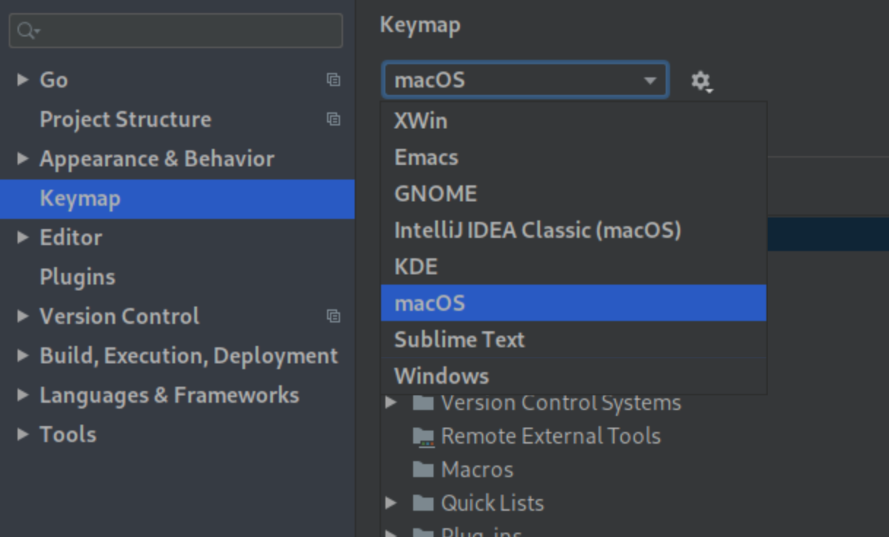

You can switch from the default Windows/Linux keybinding to macOS keybindings
when using any of the following JetBrains IDE within Coder.

To switch the keybindings:

1. From your environment overview page, launch the JetBrains IDE of your choice
2. In the newly launched multi-editor window, go to **File** > **Settings** >
   **Plugins**
3. Find the **macOS Keymap** and click **Install**
4. Use the left-hand navigation bar to switch back to **Keymap**
5. Use the **Keymap** toggle at the top to switch to **macOS**
6. Click **OK** to save your changes and proceed

