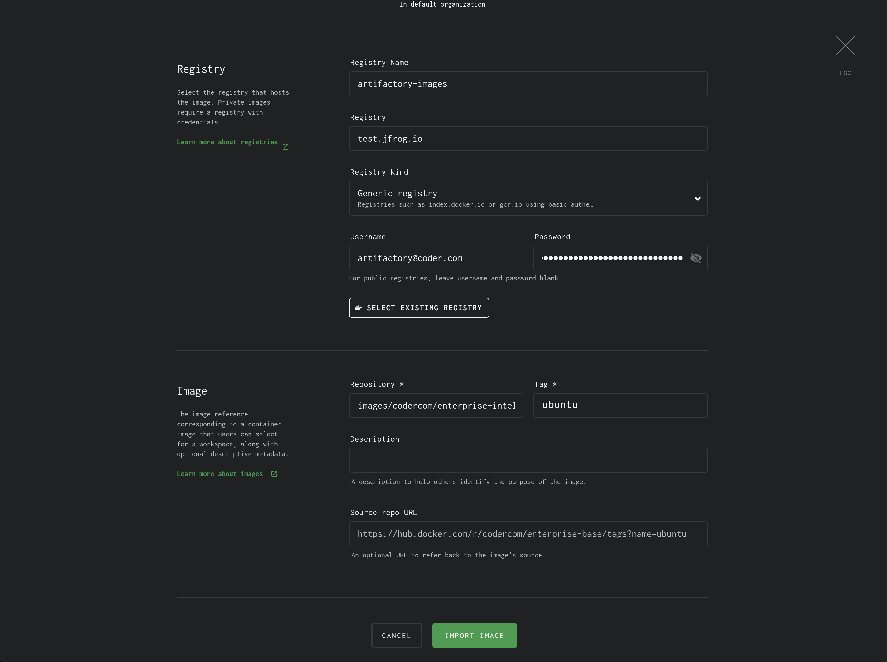

# JFrog Artifactory

This article will walk you through setting up
[Artifactory](https://jfrog.com/artifactory/) as a Docker registry in Coder.

JFrog Artifactory serves as a central hub for housing and managing any kind of
artifact you might be interested in securely managing across your entire
organization, including container images. It can be self-hosted which may be
particularly useful for hardened environments where external network access is
undesirable.

We have based these instructions off Artifactory's documentation. Please see the
following links for more information:

- [Docker Registry](https://www.jfrog.com/confluence/display/JFROG/Docker+Registry)
- [Getting Started with Artifactory as a Docker Registry](https://www.jfrog.com/confluence/display/JFROG/Getting+Started+with+Artifactory+as+a+Docker+Registry)

## Step 1: Create an Artifactory repository

1. If you do not already have an account you can
   [start up a free trial](https://jfrog.com/artifactory/) or get yourself a
   free instance to play with.
1. Log in to your Artifactory dashboard.
1. Navigate to **Repositories** in the sidebar.
1. Click **+ Add Repositories**.
1. Select **Docker**.
1. Name your repository.
1. Click **Create Local Repository**.

## Step 2: Add images

You can push and pull images as you would with any other Docker registry once
you log in.

```console
docker login $ARTIFACTORY_URL
```

If you have trouble logging in click your user account icon in the upper right
corner of the Artifactory dashboard, go to **Set Me Up**, then select **docker**
to find exactly what username and password you can provide to get logged in.

At this stage you can add any images you want to use with Coder. For example
with an image called `hello-world` and a repository called `images`:

```console
docker push $ARTIFACTORY_URL/images/hello-world
```

## Step 3: Configure Coder

To add the registry to Coder you can use the same credentials you used for
`docker login` but in production you may want to create a new user with
read-only permissions. This can be done by clicking the cog icon in the upper
right corner of your Artifactory dashboard then clicking **User Management**.

Once you have the credentials you want to use grab your Artifactory URL and and
the full path to an image then
[add a new registry](../../admin/registries/index.md) to Coder.

For example here we add an image stored at `codercom/enterprise-intellij` in an
Artifactory server called `test` and a repository called `images`:



## Other Notes

We have an open-source version of Microsoft's extension marketplace for VS Code
which is capable of using Artifactory for extension storage. If you use VS Code
or code-server with Coder and are interested in further securing your supply
chain with Artifactory check it out
[here](https://github.com/coder/code-marketplace/).
