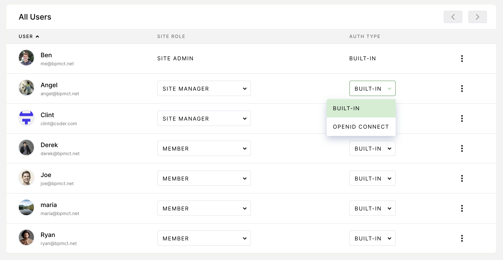

If you're deploying [code-server](https://github.com/cdr/code-server) on
Kubernetes, you may want to consider Coder, our solution for developers and
development teams. Coder runs on Kubernetes
and offers the following features in addition to the base
code-server functionality.

## Environment Consistency

- [Manage and distribute workspace images](https://coder.com/docs/images)
- [Build custom workspaces that include your project's dependencies](https://coder.com/docs/images/structure)

## Developer Workflows

- [Connect to workspaces via web: (code-server, JetBrains)](https://coder.com/docs/environments/editors#jetbrains-ides-in-the-browser)
- [Connect to workspaces via SSH or VS Code Remote](https://coder.com/docs/environments/ssh)
- [Sync local files to workspaces](https://coder.com/docs/cli/file-sync)
- [Use Docker and docker-compose in workspaces](https://coder.com/docs/environments/cvms)
- [Access and share web services in workspaces](https://coder.com/docs/environments/devurls)
- [Manage workspaces with the Coder CLI](https://coder.com/docs/cli)
- [Personalize workspaces](https://coder.com/docs/environments/personalization)

## Team Management

- [Implement single-sign-on](https://coder.com/docs/admin/access-control#openid-connect)
- [Assign user roles](https://coder.com/docs/admin/access-control/user-roles)
- [Manage organizations](https://coder.com/docs/admin/access-control/organizations)

## Operations

- [Add a private image registry](https://coder.com/docs/admin/registries)
- [Manage workspaces in multiple regions or clusters](https://coder.com/docs/admin/environment-management/workspace-providers)

## Getting Started

Coder is free to try for 60 days. See our [install
guide](https://coder.com/docs/setup) for additional details.
