This article will show you how to set up and use Keycloak to broker JumpCloud
SAML 2.0 logins to Coder.

We've based this configuration on the method described in the Keycloak Server
Administration Guide's
[Identity Brokering](https://www.keycloak.org/docs/latest/server_admin/#_identity_broker)
section.

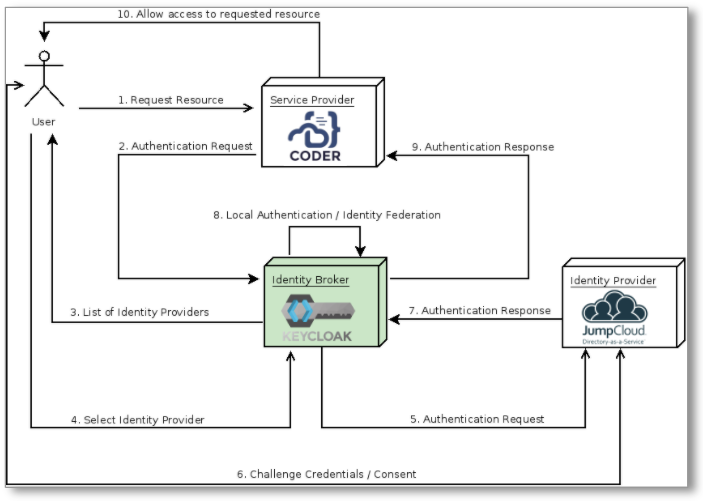

## Step 1: Create a New Realm in Keycloak

The first part of configuring the identity broker is to add a new Realm. This
Realm will be where we will add the
`JumpCloud <-> Keycloak <-> Coder SAML 2.0 to OIDC Bridge`.

1. [Set up and install](https://www.keycloak.org/getting-started) Keycloak.
1. [Create](https://www.keycloak.org/docs/latest/getting_started/#creating-a-realm)
   a new Realm.

## Step 2: Configure JumpCloud

1. Log into your JumpCloud account.

1. Go to the **SSO** page and click the **+** to add a new SSO Service Provider.

1. Click **Custom SAML App** to add a custom Keycloak configuration.

1. Add a **Display Label** (e.g., `Keycloak`).

1. Choose an **IdP Entity ID** value that is unique to your identity and
   Keycloak instance (e.g., `jumpcloud-keycloak`; this value must be the same
   for both).

1. Specify the **SP Entity ID** and the **ACS URL** for the JumpCloud SAML IdP
   that you want to connect with. These values be formatted similar to the
   following:

   **SP Entity ID**: `https://<my-keycloak-url>/auth/realms/<realm-name>`

   **ACS URL**:
   `https://<my-keycloak-url>/auth/realms/<realm-name>/broker/<keycloak-idp-alias>/endpoint`

   

1. The remaining parameters can be left as is, so click **Save** to proceed.

1. At this point, you should be able to open the **Application Configuration**
   backup on JumpCloud and export the IdP metadata to use with Keycloak.

   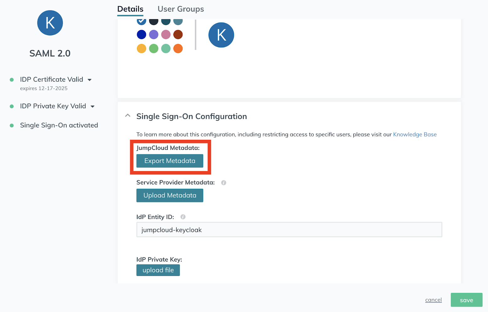

1. On the **User Groups** tab, add the JumpCloud User Group(s) that need access
   to Coder.

## Step 3: Configure Keycloak

1. Log in to Keycloak as an admin, and navigate to the Realm you created at the
   beginning of this tutorial.

1. Go to the **Identity Providers** page for your Realm and click **SAML 2.0**
   to set up your identity provider
   ([this Keycloak document](https://www.keycloak.org/docs/latest/server_admin/#saml-v2-0-identity-providers)
   provides additional information about adding a SAML 2.0 Identity Provider).

   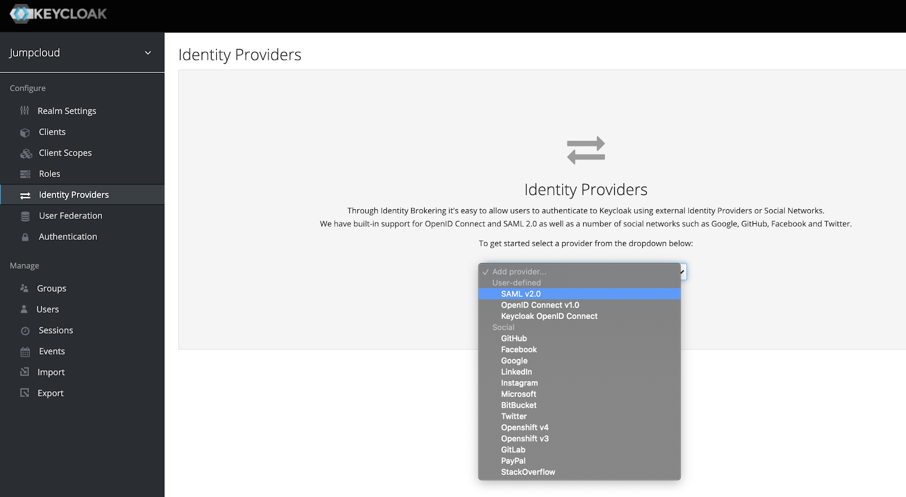

1. On the IdP configuration page, specify an **Alias** to use for your IdP
   provider.

1. Scroll to the bottom of the configuration page and upload the IdP metadata
   you exported from JumpCloud.

   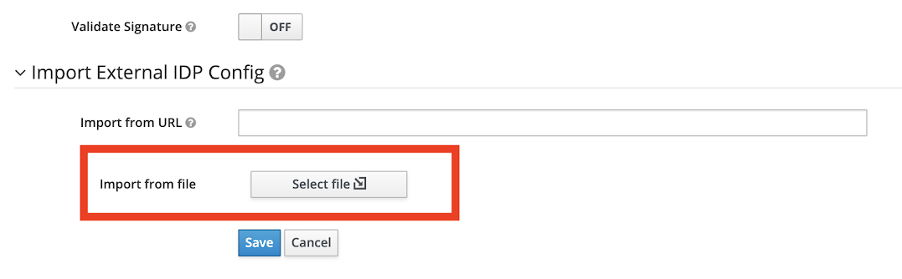

### Optional: Specify JumpCloud as the Default IdP

1. Navigate to **Authentication**.

1. Select the **Browser** flow from the dropdown in the top-left.

   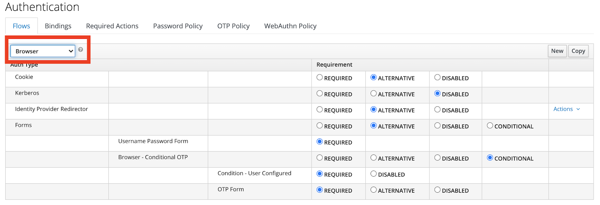

1. Find the **Identity Provider Redirector** row and click **Actions** >
   **Config**.

   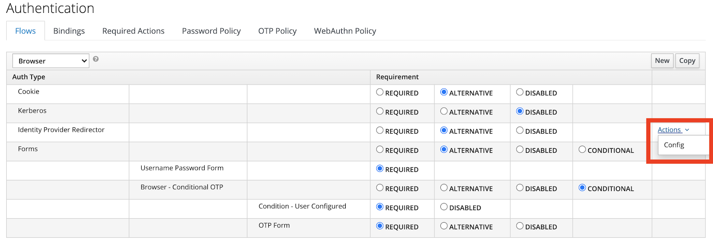

1. Set **Alias** and **Default Identity Provider** to the alias of the identity
   provider you created earlier.

   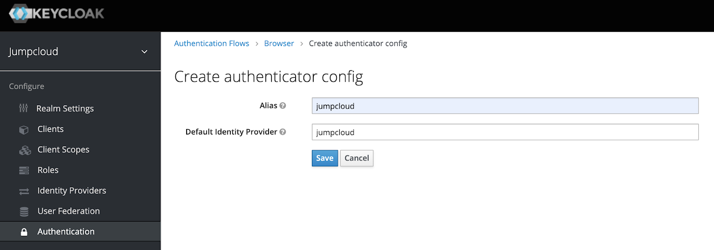

## Step 4: Configure the OpenID Connect (OIDC) Connector in Keycloak

1. Navigate to **Clients** and click **Create**.

   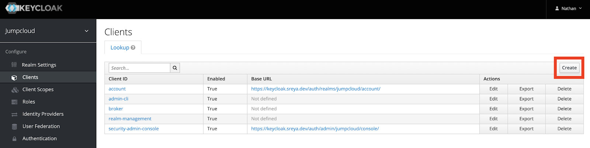

1. Add a new OIDC Client to point to your Coder deployment and click **Save**.

   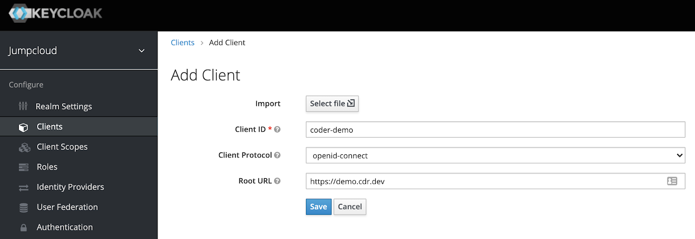

1. Once on the **Clients** configuration page, set the **Access Type** to
   **Confidential** and click **Save**.

1. Your client configuration should look something like the following (make sure
   that all of the values point to your Coder deployment):

   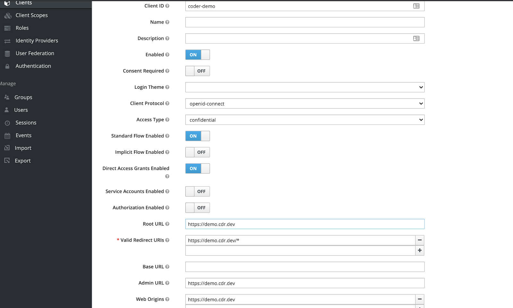

At this point, you can configure your Coder deployment to use the Keycloak OIDC
Connector.

## Step 5: Configure Coder

1. Log in to Coder as an administrator and go to **Manage** > **Admin**.

1. Go to **Authentication** and select **OpenID Connect** from the dropdown.

1. Add the **Client ID** that you specified in Keycloak.

1. Add the **Secret** to the **Client Secret** field (you can get this value
   from the **Credentials** page in the Keycloak Clients Configuration).

   

1. Add your Keycloak instance and Realm as the `Issuer`. This will be a URL
   formatted as follows: `https://<my-keycloak-url>/auth/realms/<my-realm>`

   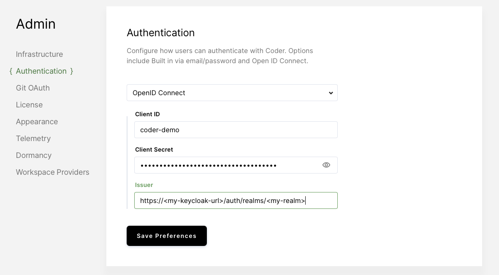

1. Click **Save Preferences**.

At this point, you should be able to log into Coder via OIDC.

> You may have to adjust your `Auth Type` on the `Users` page within your Coder
> deployment.
