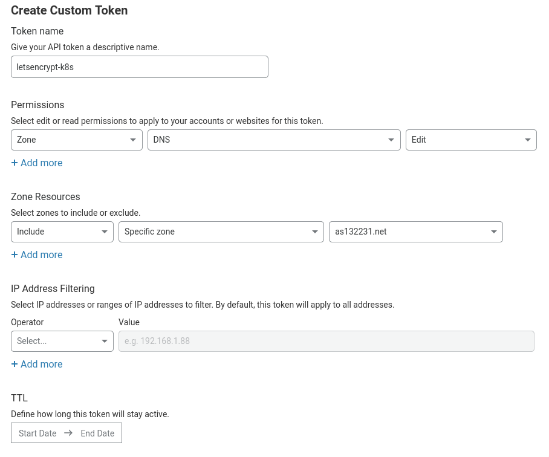

[cert-manager](https://cert-manager.io/) allows you to enable HTTPS on your
Coder installation, regardless of whether you're using [Let's
Encrypt](https://letsencrypt.org/) or you have your own certificate authority.

This guide will show you how to install cert-manager v1.0.1 and set up your
cluster to issue Let's Encrypt certificates for your Coder installation so that
you can enable HTTPS on your Coder deployment.

> We recommend reviewing the official cert-manager
> [documentation](https://cert-manager.io/docs/) if you encounter any issues or
> if you want info on using a different certificate issuer.

## Prerequisites

You must have:

- A Kubernetes cluster (v1.15 or greater) with internet connectivity
- kubectl with patch version [greater than v1.18.8, v1.17.11, or
  v1.16.14](https://cert-manager.io/docs/installation/upgrading/upgrading-0.15-0.16/#issue-with-older-versions-of-kubectl)

## Step 1: Add cert-manager to Your Kubernetes Cluster

```bash
# Kubernetes 1.16+
$ kubectl apply --validate=false -f \
https://github.com/jetstack/cert-manager/releases/download/v1.0.1/cert-manager.yaml

# Kubernetes <1.16 
$ kubectl apply --validate=false -f \
https://github.com/jetstack/cert-manager/releases/download/v1.0.1/cert-manager-legacy.yaml
```

> `--validate=false` is required to bypass kubectl's resource validation on the
> client-side that exists in older versions of Kubernetes.

Once you've started the installation process, you can verify that all the pods
are running:

```bash
$ kubectl get pods -n cert-manager

NAME                                       READY   STATUS    RESTARTS   AGE
cert-manager-7cd5cdf774-vb2pr              1/1     Running   0          84s
cert-manager-cainjector-6546bf7765-ssxhf   1/1     Running   0          84s
cert-manager-webhook-7f68b65458-zvzn9      1/1     Running   0          84s
```

## Step 2: Create an ACME Issuer

cert-manager supports HTTP01 and DNS01 challenges, as well as [many DNS
providers](https://cert-manager.io/docs/configuration/acme/dns01/#supported-dns01-providers).
This guide, however, shows you how to use Cloudflare for DNS01 challenges. This
is necessary to issue wildcard certificates, which are required for Coder's [Dev
URLs](../../admin/devurls.md) feature.

First, get the Cloudflare API credentials for cert-manager to use; cert-manager
needs permission to add a temporary TXT record and delete it after the challenge
has been completed.

Open the Cloudflare dashboard and go to [My Profile > API
Tokens](https://dash.cloudflare.com/profile/api-tokens). Click **Create Token**,
then go to **Create Custom Token** and click **Get Started**.

Create a token with the following settings:

- Permissions:
  - Zone: DNS = Edit

- Zone Resources:
  - Include: Specific Zone = your-domain.com

You can also add more zones (or give the token access to all zones in your
account), and set an expiry date.



Click **Continue to summary**, then **Create Token**. Be sure to copy and save
the token displayed because Cloudflare will not display it again.

Now that we have our Cloudflare API token, we need to configure cert-manager to
use it. In a text editor, create a new file called **issuer.yaml** and paste the
following:

```yaml
apiVersion: v1
kind: Secret
metadata:
  name: cloudflare-api-key-secret
  namespace: coder # Your Coder deployment namespace
type: Opaque
stringData:
    api-key: "" # Your Cloudflare API token (from earlier)

---
apiVersion: cert-manager.io/v1alpha2
kind: Issuer
metadata:
  name: letsencrypt
  namespace: coder # Your Coder deployment namespace
spec:
  acme:
    email: "" # Your email address (given to Let's Encrypt)
    server: "https://acme-v02.api.letsencrypt.org/directory"
    privateKeySecretRef:
      name: letsencrypt-account-key
    solvers:
    - dns01:
        cloudflare:
          email: "" # Your Cloudflare email address
          apiTokenSecretRef:
            name: cloudflare-api-key-secret
            key: api-key

      # This section denotes which domains to use this issuer for. If you didn't
      # limit which zones the API token had access to, you may wish to remove
      # this section.
      selector:
        dnsZones:
          # Only use this issuer for the domain example.com and its subdomains.
          - 'example.com'
```

### ClusterIssuers

cert-manager has a concept of **Issuer** (which are per-namespace) or
**ClusterIssuer** (which are global to the entire cluster). If you plan on using
cert-manager only for Coder, you may choose to use the **Issuer** configuration
above. If you want to use a **ClusterIssuer** instead, you'll need to make the
following changes:

- Change the namespace of the secret to **cert-manager**
- Change the kind of the **Issuer** to **ClusterIssuer**
- Remove the namespace of the **ClusterIssuer**
- Change the additional annotations to `cert-manager.io/cluster-issuer: letsencrypt`

For further information, see [Setting Up
Issuers](https://docs.cert-manager.io/en/release-0.8/tasks/issuers/index.html).

Read the comments and fill out the blanks. Once you're done, you can go ahead
and apply that to your cluster using:

```bash
$ kubectl apply -f issuer.yaml

secret/cloudflare-api-key-secret created
issuer.cert-manager.io/letsencrypt created
```

## Step 3: Configure Coder to Issue and Use the Certificates

If your installation uses an external egress, you'll need to configure your
ingress to use the **coder-root-cert** and **coder-devurls-cert**.

However, if you're using the default
[ingress](https://cert-manager.io/docs/usage/ingress/) included in the helm
chart, you can use the following helm values to configure the internal ingress
and automatically create your certificate:

```yaml
ingress:
  useDefault: true
  host: "coder.example.com"
  tls:
    enable: true
    hostSecretName: coder-root-cert
    devurlsHostSecretName: coder-devurls-cert
  additionalAnnotations:
  - 'cert-manager.io/issuer: letsencrypt'

devurls:
  host: "*.coder.example.com"
```

Be sure to redeploy Coder after altering your helm values.
