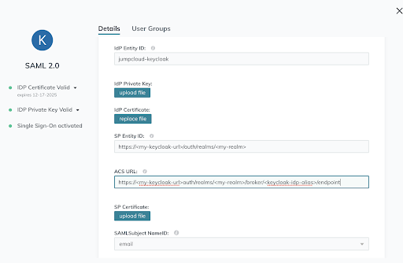

## Configuring the Broker

This configuration is based on the method described in the [Identity Brokering Section](https://www.keycloak.org/docs/latest/server_admin/#_identity_broker)
of the Keycloak server manual.

To configure the Broker:

1. [Setup and install keycloak.](https://www.keycloak.org/getting-started)
2. Add a new Realm.

    This Realm will be where we will add the
    `JumpCloud <-> Keycloak <-> Coder SAML 2.0` to the OIDC bridge.

3. Login to your JumpCloud account.

4. Go to the `SSO` page and click `+` to add a new SSO Service Provider.

5. Click `Custom SAML App` to add a custom Keycloak configuration.

6. Add a `Display Label`.

7. For `IdP Entity ID`, select a value that is unique for your IdP and Keycloak instance.
This value must be the same on both.

8. Specify the `SP Entity ID` and the `ACS URL` for your JumpCloud SAML IdP to
connect with.

    These values should be of the form:

    8.1. `SP Entity ID` - `https://<my-keycloak-url>/auth/realms/<realm-name>`

    8.2. `ACS URL` - `https://<my-keycloak-url>/auth/realms/<realm-name>/broker/<keycloak-idp-alias>/endpoint`

    

9. The remainaing values are optional. Click `save`.

10. You can now open the Application Configuration backup on JumpCloud and export
the IdP metadata for use in Keycloak.

    

11. Add the JumpCloud User Group(s) that will access your Coder deployment in the
`User Groups` tab.

12. Login to Keycloak as an admin and navigate to the Realm you created earlier.

13. Go to the `Identity Providers` page for your Realm and click `SAML 2.0`.

    [This Keycloak docoument](https://www.keycloak.org/docs/latest/server_admin/#saml-v2-0-identity-providers)
    gives additional information about adding a SAML 2.0
    Identity Provider.

    

14. On the IdP configuration page, specify an `Alias` to use for your IdP provider.

15. Scroll down to the bottom of the configuration page and upload the metadata
configuration you previously exported from JumpCloud.

    

16. (Optional) To specify JumpCloud as your default Identity Provider:

    16.1 Navigate to `Authentication`.

    16.2 Select the `Browser` flow from the dropdown in the top left corner.

    

    16.3 Click config for the `Identity Provider Redirector` authenticator.

    

    16.4 Set `Alias` and `Default Identity Provider` to the alias of the identity
    provider created earlier.

    

## Configuring the OpenID Connect (OIDC) Connector

1. Navigate to `Clients` and click `Create`.

    

2. Add a new OIDC Client to point to your Coder deployment and click `Save`.

    

3. Once on the Client configuraiton page, set the `Access Type` to `Confidential`
and click `Save`.

4. Your client configuration should look similar to the following, except pointed
to your own Coder deployment.

    

5. You can now configure your Coder deployment to use the Keycloak OIDC connector.

6. Login to your Coder deployment as an administrator and navigate to `Manage > Admin`.

7. Navigate to `Authentication` and select `OpenID Connect` from the dropdown.

8. Add your `Client ID` that you specified in Keycloak.

9. Navigate to the `Credentials` page in your Keycloak Client configuration and
copy the `Secret` value to use in your Coder deployment.

    

10. Navigate back to Coder and paste the `Secret` value into the `Client Secret`
field.

11. Add your keycloak instance and realm as the `Issuer`.

    This URL will be of the format: `https://<my-keycloak-url>/auth/realms/<my-realm>`

    

12. Click `Save Configuration`.

Once complete, you should be able to login via OIDC.

    **Note**: You may have to adjust your `Auth Type` on the `Users` page within
    your Coder deployment.
