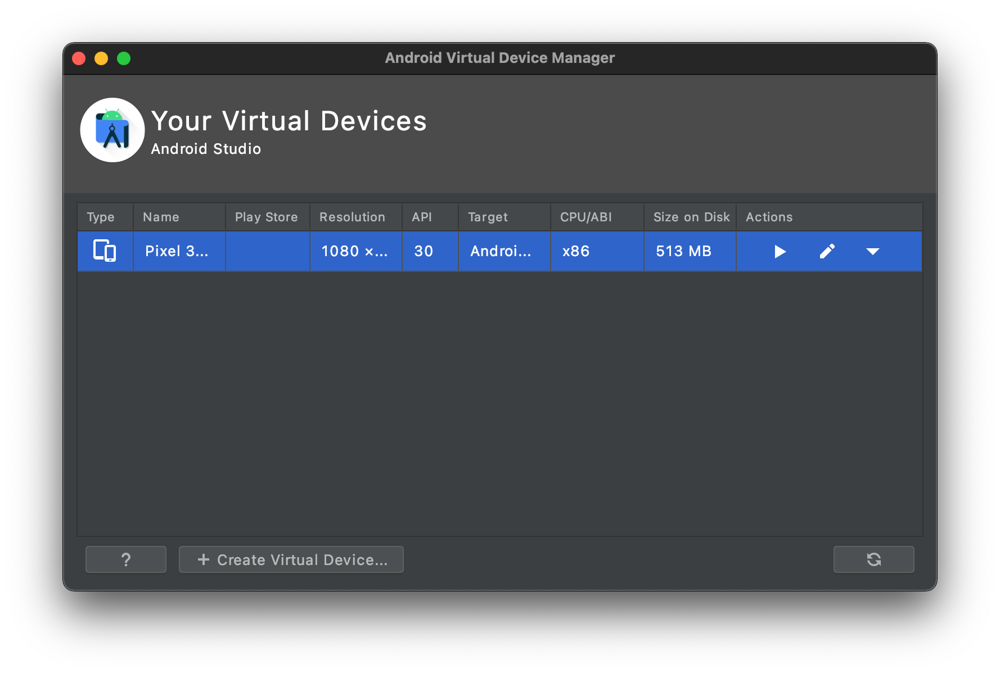

# Mobile development

Compiling mobile applications are resource-intensive, but Coder allows you to
leverage cloud resources to save time compiling while still keeping your native
emulator experience.

### Android

You can use the Android emulator on your local machine to build and debug apps
developed remotely on Coder.

1. [Install Android Studio](https://developer.android.com/studio) onto your
   local machine.

1. Start Android Studio, and when prompted, install the SDK.

   

1. [Create and start](https://developer.android.com/studio/run/managing-avds) a
   Virtual Device.

   

1. Create a workspace variable called `ANDROID_SDK_PATH` and set it to the
   installation path of your Android SDK (for example, it's typically
   `~/Library/Android/sdk` on macOS and
   `C:\Users\<USER_NAME>\AppData\Local\Android\sdk` on Windows).

   

1. Start the Android Debug Server on port 5555:

   ```console
   $ $ANDROID_SDK_PATH/platform-tools/adb tcpip 5555
   restarting in TCP mode port: 5555
   ```

1. Create a Coder workspace that includes the Android SDK; you can do this by
   including the following in your Dockerfile:

   ```Dockerfile
   FROM codercom/enterprise-android
   ```

   Alternatively, you can import or extend
   [Coder's image](https://github.com/coder/enterprise-images/blob/master/images/android/Dockerfile.ubuntu)

1. Forward your Android Debug Server to the remote workspace:

   ```console
   # You must have the Coder CLI installed.
   $ coder config-ssh
   $ ssh -R 5555:127.0.0.1:5555 coder.<NAME_OF_YOUR_WORKSPACE>
   ```

1. Run `adb devices` to view the emulators forwarded from your local machine:

   ```console
   $ adb devices
   List of devices attached
   emulator-5556
   ```

1. Build and run your Android applications remotely:

   ```console
   ./gradlew android:installDebug
   ```
