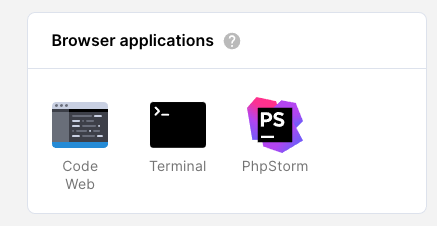
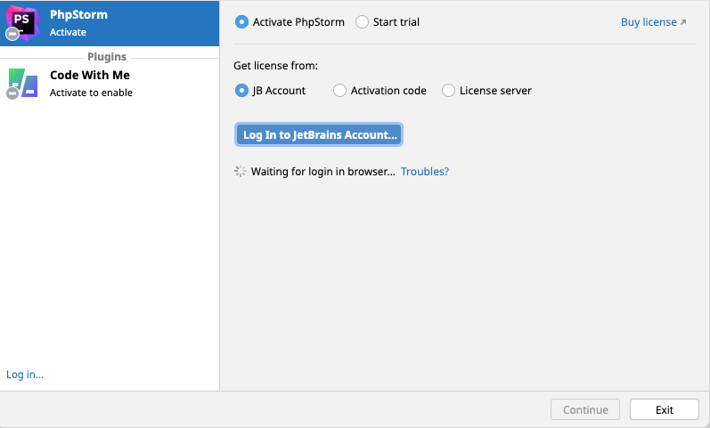
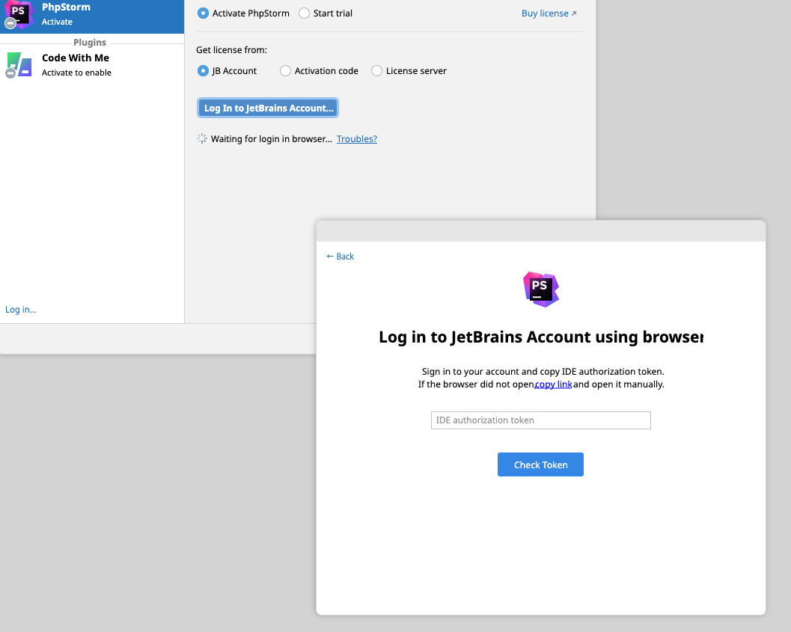
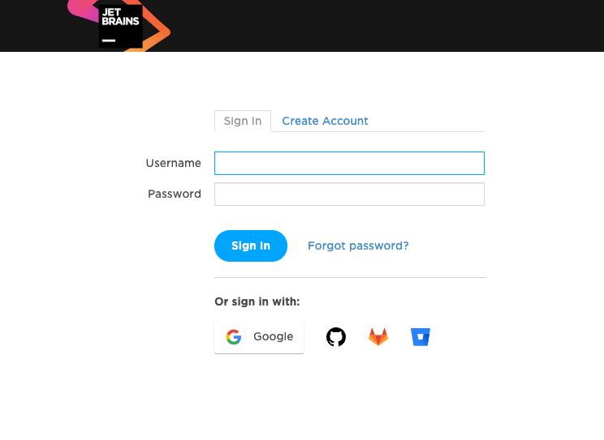
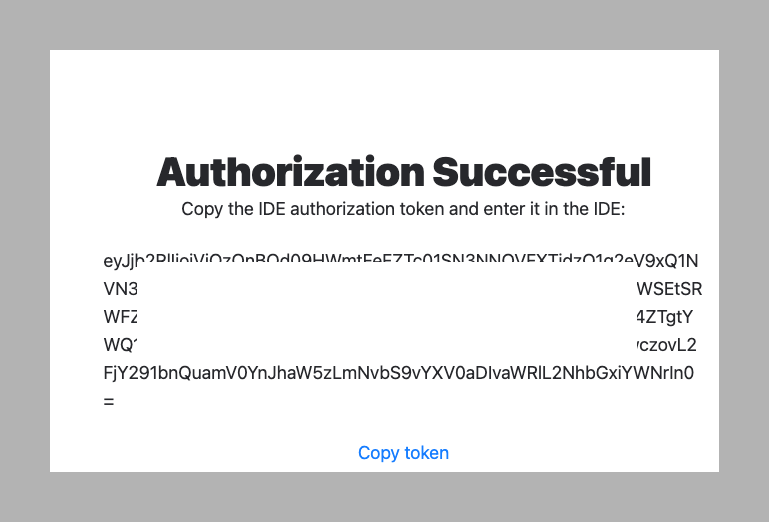
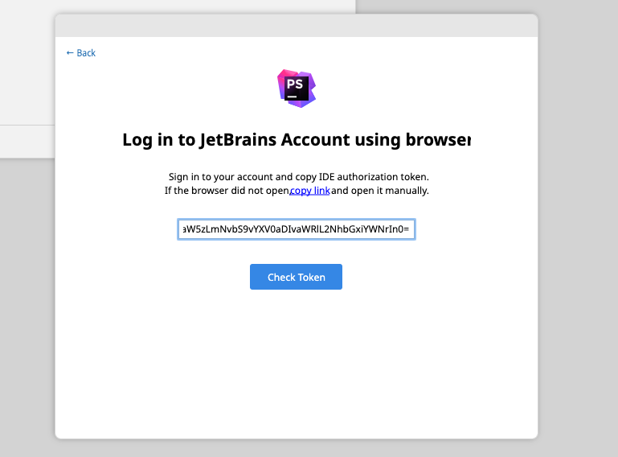
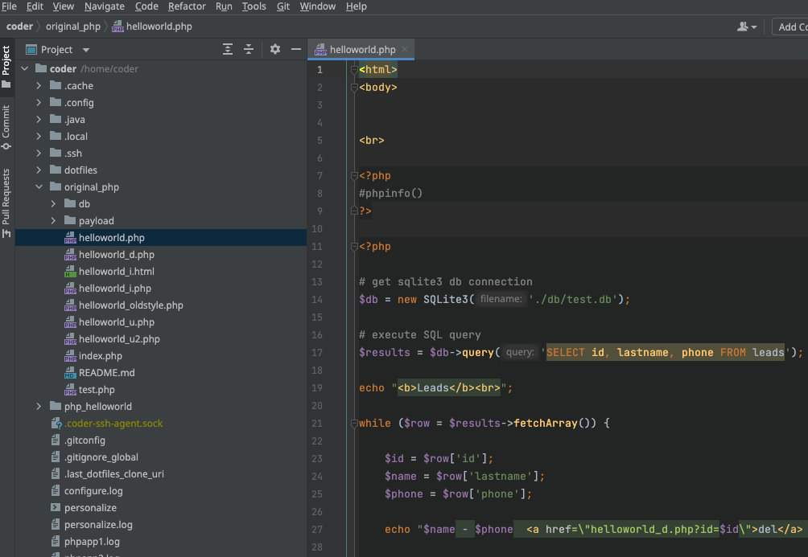

JetBrains requires a valid license to evaluate or use a JetBrains IDE. When
running a JetBrains IDE in a browser, you need to perform the following steps.

1. [Click the JetBrains IDE icon](activate-jetbrains-licensing.md#launch-the-jetbrains-ide-in-a-browser)
   in your Coder workspace
1. [Click the "Log In to JetBrains Account" button](activate-jetbrains-licensing.md#log-into-your-jetbrains-account)
1. Since your IDE is in the web browser, click the
   ["Troubles" link](activate-jetbrains-licensing.md#click-the-troubles-link) to
   use an alternate login method
1. [Click the "copy" link](activate-jetbrains-licensing.md#click-the-copy-link),
   open a new browser window and paste the link
1. [Log into JetBrains with your valid JetBrains credentials](activate-jetbrains-licensing.md#login-with-your-jetbrains-account)
   to get an IDE authentication token
1. [Click "Copy token"](activate-jetbrains-licensing.md#click-copy-token) to
   copy your IDE authentication token
1. [Paste the token](activate-jetbrains-licensing.md#paste-the-ide-authentication-token)
   back into your JetBrains IDE window
1. [Start using JetBrains](activate-jetbrains-licensing.md#start-using-jetbrains)

## Launch the JetBrains IDE in a browser

Launch the JetBrains IDE in the browser from the workspaces page by clicking the
JetBrains IDE icon. This example uses the JetBrains PhpStorm IDE.

## Log into your JetBrains account

Click the Log In to JetBrains Account button. You need a valid JetBrains account
to proceed for both a trial and a paid license.

## Click the Troubles link

Because you already are in a browser, a new browser window cannot open. Click
the Troubles link to proceed.

## Click the copy link

Click the copy link, open a new browser window, and paste the copied link to go
to the JetBrains website to log in.

## Login with your JetBrains account

At the JetBrains website, login with your valid JetBrains account to get the IDE
authentication token.

## Click Copy token

Click the Copy token link to copy the IDE authentication token to your
clipboard.

## Paste the IDE authentication token

Paste the IDE authentication token back into your already opened JetBrains IDE
window. Type CMD + v or Control + v depending on your local OS for the paste
operation to work correctly. 

## Start using JetBrains

You can now use the JetBrains IDE in a browser.

