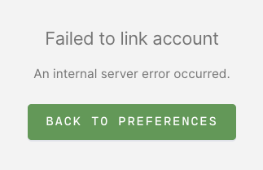

When configuring the OAuth integration between Coder & GitHub, you
may encounter the error below:



## Why this happens

This happens when your Coder public key has been uploaded to your
GitHub profile prior to your attempt to link Coder & GitHub. The error is thrown
due to the OAuth integration duplicating your public key in GitHub.

## Solution

1. Remove your Coder public key from your GitHub account

1. In Coder, navigate to **Account** > **Linked Accounts** and click
**Link Your GitHub Account**

1. If successful, you will be re-directed back to the account page, with a
   message in the bottom right corner stating:

   ```console
   Successfully linked to GitHub account <your-GitHub-username>
   ```

If the above is not the source of the issue, then it may be
related to your configuration values in Coder's Admin panel. To view such values
navigate to **Manage** > **Admin** > **Git OAuth**.
