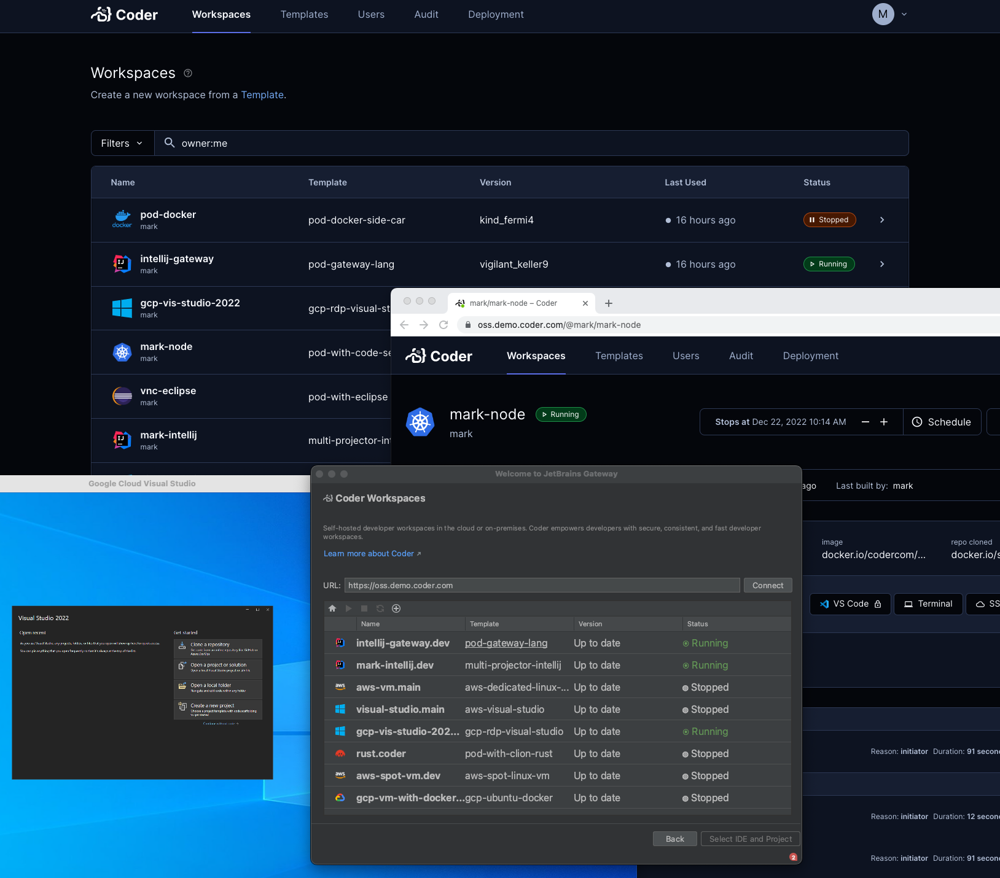

[Coder v2](https://github.com/coder/coder) is Coder's 2nd generation remote
development platform launched in June 2022. This document lists frequently asked
questions for customers planning to migrate from Coder v1 to v2.

When will Coder no longer support v1?

Coder v1 will have 3 sunset or end-of-life dates.

| Date            | Support Sunset Parameters                                    |  Example                                       |
| --------------- | ------------------------------------------------------------ | ---------------------------------------------- |
| 06/30/2023      | End of feature requests and enhancements                     | image tag decommissioning coming in `1.38.0`   |
| 12/31/2023      | End of feature-related bug fixes                             | [organization sort order](../changelog/1.37.0.md) in in `1.37.0`             |
| 03/31/2024      | End of security vulnerability fixes                          | malicious [DevURL redirect link fix](../changelog/1.37.1.md) in `1.37.1` |

How will we continue to get v1 support?

Continue to either coordinate with your Coder account executive or leverage
the [Slack](https://cdr.co/join-community) channel.

Why did Coder build v2?

Coder v2 addresses compute and integration limitations of Coder v1. In
particular, 100% control over a workspace's Kubernetes pod spec, flexibility to
make workspace compute a Kubernetes pod, a VM, or a Docker container, and an
open-source platform for the community to get the developer-centric benefits of
remote development without a license fee. See the blog post [Lessons learned
from
v1](https://coder.com/blog/lessons-learned-from-v1-and-oss-to-enterprise-editions).

What Coder v2 features are open-source and paid?

Functionality for a developer to be productive are in the v2 OSS, while
scalability, governance and control features for DevOps teams are in the
v2 Enterprise paid version. [See this page for feature
comparisons.](https://coder.com/pricing)

Will I pay the same for Coder v2?

[Contact Sales](https://coder.com/contact) to learn how your v1 license fee
converts to v2.

Is v2 a different code base?

Yes. Because we wanted to make v2 open-source and use Terraform as the workspace
provisioning engine, it was easier to re-build Coder's remote development
platform into a new code base. v2 also has a different Postgres database schema.

How are the v2 concepts different than v1 at a high-level?

In v1, workspaces are Kubernetes pods with an inner container based on [container
images](../images/index.md) with an optional configure script in the image that runs additional
configurations as the non-root user after the workspace is built. Coder v1 has an
optional workspace template yaml spec to define compute and additional bash
scripting steps.

In Coder v2, workspaces are defined as [Terraform
templates](https://coder.com/docs/coder-oss/latest/templates) with Terraform
resources to specify the infrastructure provider and compute type. e.g.,
Kubernetes pod, Docker container, or VM. Docker or alternatively VM images are
specified in the template. The template includes an agent resource and
`startup_script` configuration that can run the configure script in the image or
additional steps like in v1 workspace templates. Coder v1 workspace applications
are configured as `coder_app` resources in the Terraform template.

v1 [organizations](../admin/organizations/index.md) are
[groups](https://coder.com/docs/coder-oss/latest/admin/groups) in v2.

Integration points remain the same like
[OIDC](https://coder.com/docs/coder-oss/latest/admin/auth) for single-sign-on
and specifying image registries in v2 templates.

Out-of-the-box Git authentication in v1 is an OAuth app and SSH. In v2, [OAuth
is used as well](https://coder.com/docs/coder-oss/latest/admin/git-providers)
but Coder intercepts git actions, forcing the user to authenticate to their git
provider. Coder stores the user's OAuth token in the Coder database and using it
for subsequent git actions. In v2, Coder issues an SSH key to each user if that
is preferred.

Are there migration scripts from v1 to v2?

No. The database schema and architectural concepts are so different in v2, it is
not reasonable to build migration scripts that meet all customer deployment
scenarios. See [the migration strategy](./moving-to-oss.md#migration-strategy)
and [recommendations on moving workspace
contents](./moving-to-oss.md#workspaces).

Is there a community to support v2?

Yes. In v1, Coder maintains a [Slack](https://cdr.co/join-community) channel. In
v2, customers can file [GitHub Issues](https://github.com/coder/coder/issues) or
use our [Discord](https://discord.gg/coder) or
[Slack](https://cdr.co/join-community) channels to ask questions to the
community.

 

> For more information on Coder v2 concepts, please review the [Moving to Coder
> v2](./moving-to-oss.md) guide.

