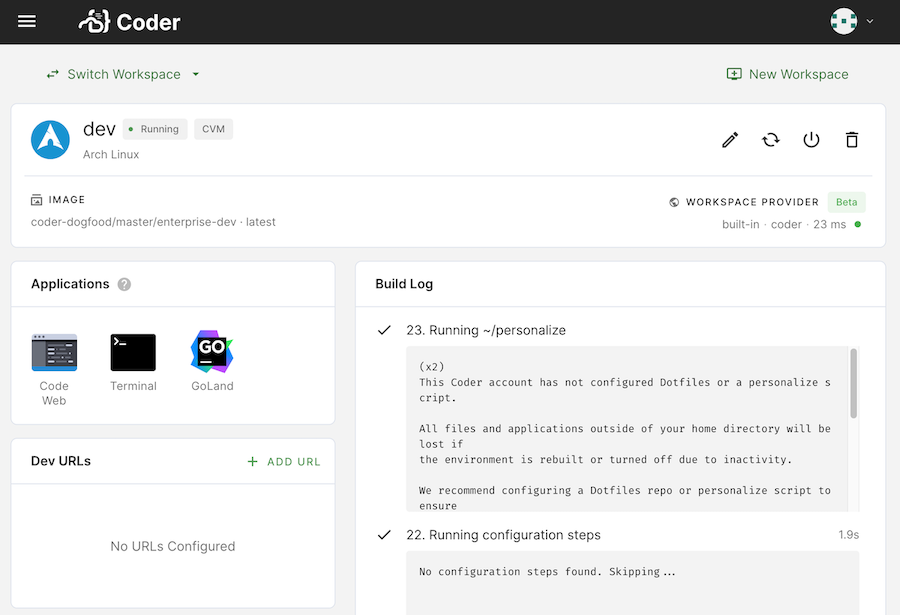

# Configure script

If you have configuration instructions that apply to everyone who uses a given
image to create workspaces, you can define them using the **/coder/configure**
file.

You can use the configure script to:

- Run scripts to install and configure dependencies for your workspace
- Install VS Code extensions
- Run [Coder CLI](https://github.com/coder/coder-cli) commands
- Check for and clone a GitHub repo if it isn't present
- Run scripts using
  [CODER\_\* environment variables](../workspaces/variables.md)

> We strongly recommend changing the `USER` to `coder` as the final step of your
> Dockerfile so that the configure script runs as the `coder` user. This change
> ensures that Coder stores all installation and configuration information in
> the persisted `/home/coder` folder (the only time this is _not_ the case is if
> a command is prefaced by `sudo`).

Coder will check the image for the presence of a **/coder/configure** file
during the build process; if Coder finds one, it will execute the instructions
contained. You copy the configure file into the image when creating the
Dockerfile.

The following steps will show you how to create and use a config file.

## Step 1: Create the configure file

Using the text editor of your choice, create a file named `configure` and make
it executable:

```console
touch configure
chmod +x configure
```

Next, add the instructions that you want included. For example, the following
file shows how you can clone a repo at build time:

```console
#!/bin/bash
if [ ! -d "/home/coder/workspace/project" ]
then
ssh-keyscan -t rsa <yourGitProviderEndpoint> >> ~/.ssh/known_hosts
git clone git://company.com/project.git /home/coder/workspace/project
else
echo "Project has already been cloned."
fi
```

> Ensure that you change the `<yourGitProviderEndpoint>` placeholder in the
> `ssh-keyscan` command (e.g., `github.com`, `bitbucket.org`, `gitlab.com`).

Note that the instructions provided include `if-else` logic on whether the
instructions should be re-run (and when) or if Coder should run the instructions
only once. We strongly recommend including this logic at all times to minimize
overhead.

> Any commands run with `sudo` will, by default, not include the environment
> variables of your user. If you'd like to preserve your existing env variables,
> [pass the `-E` flag to your `sudo` invocation](https://man7.org/linux/man-pages/man8/sudo.8.html).

## Step 2: Add the configure file to the image

Once you have a config file, update your image to use it by including the
following in your Dockerfile:

```dockerfile
COPY [ "configure", "/coder/configure" ]
```

As an example, take a look at the sample Dockerfile that follows; the final line
includes instructions to Coder on copying the settings from the configure file:

```dockerfile
FROM ubuntu:latest
RUN apt-get update && apt-get install -y curl
COPY [ "configure", "/coder/configure" ]
USER coder
```

## Step 3: Build and push the image and config file

To make your image accessible to Coder, build the development image and push it
to your container registry.

You can build your image by running the following command in the directory where
your Dockerfile is located (be sure to replace the `user/repo:latest`
placeholder value with your user, repository and tag names so that the image is
pushed to the appropriate location):

```console
docker build user/repo:latest .
```

Once you've built the image, push the image to the Docker registry:

```console
docker push user/repo:latest
```

## Step 4: Test the config file

You can test your setup by performing the following steps:

1. [Importing your image](importing.md)
1. [Creating your workspace using the newly imported image](../workspaces/create.md)

Coder will run the configure file during the build process. You can verify this
by:

- Reviewing the build log on the **Workspace Overview** page (Coder runs the
  configure file as the second-to-last step of the build process)
- Opening the terminal, ensuring that you're in the `/home/coder` folder, and
  running `cat configure.log`.



## Examples

The following are examples of instructions you can include in your configure
file.

### Copying Coder's sample config file

Coder's [base images](https://github.com/coder/enterprise-images) include a
basic configure script, which you can copy and modify:

```Dockerfile
# Dockerfile

FROM ...

COPY configure /coder/configure

USER coder
```

#### Extending a configure script in a base image

If you're extending a Coder image that has a configure file that you'd like to
preserve, the following steps show you how to avoid writing over the original
script.

1. Create the configure script

   ```shell
   touch configure
   chmod +x configure
   ```

1. Modify the image's Dockerfile to move the original configure script (this
   results in Coder using the configure script that you created in the previous
   step while preserving the original script)

   ```Dockerfile
   # Dockerfile

   FROM codercom/enterprise-configure:ubuntu

   USER root

   RUN mv /coder/configure /coder/configure-first

   # Add the new configure script
   COPY configure /coder/configure

   USER coder
   ```

1. Create your new script; in addition to any instructions that you add, this
   script will run the configure script that came with the base image

   ```sh
   # Configure

   # Run the initial configure script
   sh /coder/configure-first

   print "And some more commands..."
   ...
   ```

### Running Coder CLI commands

The following shows how to run a [Coder CLI command](../cli/index.md) in your
configure script by demonstrating how you can create a Dev URL:

```sh
# configure

# Create a Dev URL (or update if it already exists)
coder urls create $CODER_WORKSPACE_NAME 3000 --name webapp
```

### Modifying VS Code settings

1. Create a `settings.json` file:

   ```sh
   touch settings.json
   chmod +x settings.json
   ```

1. Add settings info to your file:

   ```json
   {
     "git.enableSmartCommit": true,
     "git.confirmSync": false,
     "editor.formatOnSave": true
   }
   ```

1. Update `configure` to use the settings file:

   ```sh
   # configure

   # Check if there are existing settings
   if [ -f "/home/coder/.local/share/code-server/User/settings.json" ]
   then
       echo "VS Code settings are already present. Remove with and run
       /coder/configure to revert to defaults"
   else
       cp settings.json /home/coder/.local/share/code-server/User/settings.json

       # Install extensions
       /var/tmp/coder/code-server/bin/code-server --install-extension esbenp.prettier-vscode
   fi
   ```

> You can also modify VS Code settings using
> [dotfiles repos](../workspaces/personalization.md#dotfiles-repo) which are
> cloned and executed as the final workspace build step.
