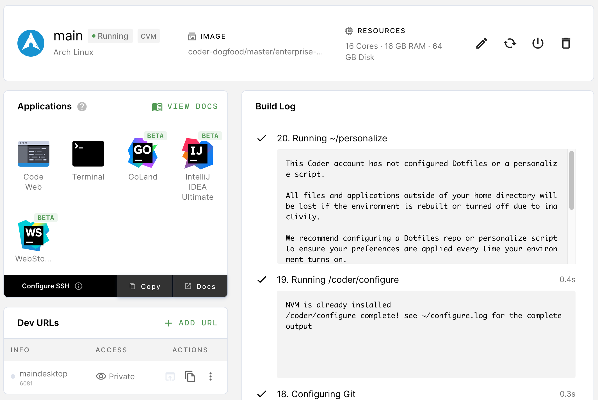

If you have configuration instructions that apply to everyone who uses a given
image to create environments, you can define them using the **/coder/configure**
file.

You can use the configure script to:

- Run [Coder CLI](https://github.com/cdr/coder-cli) commands
- Check for and clone a GitHub repo if it isn't present
- Run scripts using
  [CODER\_\* environment variables](../environments/variables.md)

Coder will check the image for the presence of a **/coder/configure** file
during the build process; if Coder finds one, it will execute the instructions
contained.

The following steps will show you how to create and use a config file.

## Step 1: Create the Configure File

Using the text editor of your choice, create a file named `configure` and add
the instructions that you want included. For example, the following file shows
how you can clone a repo at build time:

```console
#!/bin/bash
if [ ! -d "/home/coder/workspace/project" ]
then
git clone git://company.com/project.git /home/coder/workspace/project
else
echo "Project has already been cloned."
fi
```

Note that the instructions provided include logic on whether the instructions
should be re-run (and when) or if Coder should run the instructions only once.
We strongly recommend including this logic at all times to minimize overhead.

## Step 2: Add the Configure File to the Image

Once you have a config file, update your image to use it by including the
following in your Dockerfile:

```dockerfile
COPY [ "configure", "/coder/configure" ]
```

As an example, take a look at the sample Docker file that follows; the final
line includes instructions to Coder on copying the settings from the configure
file:

```dockerfile
FROM ubuntu:latest
RUN apt-get update && apt-get install -y curl
COPY [ "configure", "/coder/configure" ]
```

## Step 3: Build and Push the Image and Config File

To make your image accessible to Coder, build the development image and push it
to the Docker registry.

To build your image, run the following command in the directory where your
Dockerfile is located (be sure to replace the cdr/config placeholder value with
your tag and repository name so that the image is pushed to the appropriate
location):

```console
docker build cdr/config .
```

Once you've built the image, push the image to the Docker registry:

```console
docker push cdr/config
```

## Step 4: Test the Config File

You can test your setup by performing the following steps:

1. [Importing your image](importing.md)
1. [Creating your environment using the newly imported image](../environments/getting-started.md)

Coder will run the configure file during the build process, and you can verify
this using the Environment Overview page (Coder runs the configure file as the
penultimate step of the build process):



## Examples

The following are examples instructions you can include in your configure file.

### Copying Coder's Sample Configure File

Coder's [base images](https://github.com/cdr/enterprise-images) include a basic
configure script, which you can copy and modify:

```Dockerfile
# Dockerfile

FROM ...

COPY configure /coder/configure
```

#### Extending a Configure Script in a Base Image

If you're extending a Coder image that has a configure file that you'd like to
preserve, the following steps show you how to avoid writing over the original
script.

1. Create the configure script

   ```shell
   touch configure
   chmod +x configure
   ```

1. Modify the image's Dockerfile to move the original configure script (this
   results in Coder using the configure script that you created in the previous
   step while preserving the original script)

   ```Dockerfile
   # Dockerfile

   FROM codercom/enterprise-configure:ubuntu

   USER root

   RUN mv /coder/configure /coder/configure-first

   # Add the new configure script
   COPY configure /coder/configure
   ```

1. Create your new script; in addition to any instructions that you add, this
   script will run the configure script that came with the base image

   ```sh
   # Configure

   # Run the initial configure script
   sh /coder/configure-first

   print "And some more commands..."
   ...
   ```

### Running Coder CLI Commands

The following shows how to run a Coder CLI command in your configure script by
demonstrating how you can create a Dev URL:

```sh
# configure

coder ...

# Create a Dev URL (or update if it already exists)
coder urls create $CODER_ENVIRONMENT_NAME 3000 --name webapp
```

### Modifying VS Code Settings

1. Create a `settings.json` file:

   ```sh
   touch settings.json
   chmod +x settings.json
   ```

1. Add settings info to your file:

   ```json
   {
     "git.enableSmartCommit": true,
     "git.confirmSync": false,
     "editor.formatOnSave": true
   }
   ```

1. Update configure to use the settings file:

   ```sh
   # configure

   # Check if there are existing settings
   if [ -f "/home/coder/.local/share/code-server/User/settings.json" ]
   then
       echo "VS Code settings are already present. Remove with and run
       /coder/configure to revert to defaults"
   else
       cp settings.json /home/coder/.local/share/code-server/User/settings.json

       # Install extensions
       /opt/coder/code-server/bin/code-server --install-extension esbenp.prettier-vscode
   fi
   ```
