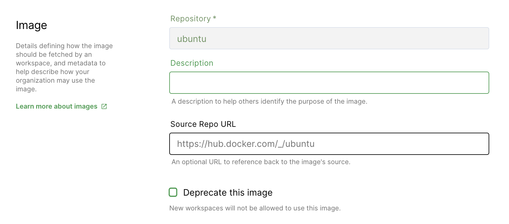
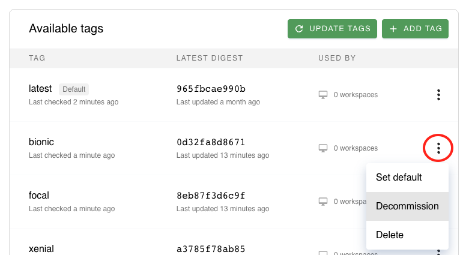

# Deprecate and Decommission

At a certain point, you may wish to deprecate a specific workspace image in
favor of a newer one. Coder provides two mechanisms to control workspace image
lifecycles:

## Deprecate an Image

Deprecation controls whether an entire image repository (and all tags) can be
used to create new workspaces.

You can mark images as deprecated to prevent them from being used to create new
workspaces. For example, if you have an existing workspace image based on an
older OS release, and you create a new workspace image based on a newer OS
release, you can **Deprecate** the old workspace image to ensure that new
workspace images use the newer OS release.

To mark an image as **deprecated**:

1. Go to **Images** and find the image to mark as deprecated.
1. Click **Edit**.
1. Select the **Deprecate this image** checkbox.
1. Click **Update Image** to save your changes.

> Users cannot create new workspaces using deprecated images. However, they can
> continue to use _existing_ workspaces created with the now-deprecated images
> and edit the resources allocated to that workspace.

## Decommission an Image Tag

Decommissioning controls whether an **individual** image tag can be used to
create new workspaces. This may be useful in an environment where image tags are
considered _immutable_.

You can **decommission** an existing image tag to prevent them from being used
to create new workspaces. Additionally, existing workspaces using this tag will
be updated to use the **default image tag** upon their next rebuild.

> ⚠️ You cannot decommission the default image tag. If you need to do so, update
> the default tag and then decommission the previous default tag.

To **decommission** an image tag:

1. Go to **Images** and find the image whose tag you wish to decommission.
1. Under **Available Tags**, find the tag you wish to decommission.
1. Click the three-dot menu to the right in the table, and select
   **Decommission**. A dialog will appear asking you to confirm your decision.

To reverse this process, repeat the above steps but select **Recommission**
instead.
