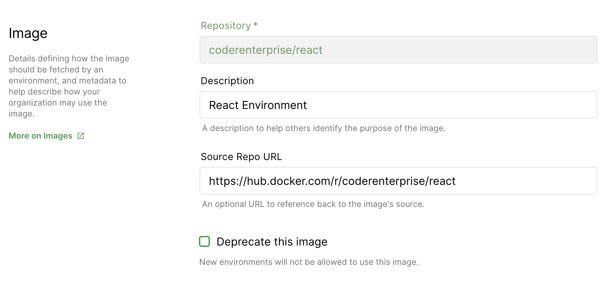

You can mark images as deprecated to prevent them from being used to create new environments.

1. Go to "Images" and find the image you want to deprecate.
2. Click "Edit".
3. Select the "Deprecate this image" checkbox.
4. Click "Update Image" to save your changes.

> Users cannot create new environments using deprecated images. Still, they can
> continue to use *existing* environments created with the now-deprecated images
> and edit the resources.
