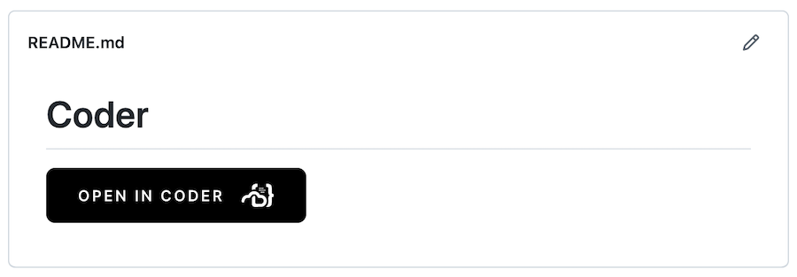

You can embed an Open in Coder button onto a code repository's README file to provide developers with a one-click way to start contributing code.
When a user clicks on the embeddable button, they will be directed to a specific deployment of Coder, prompted to authenticate if a session is not already active. Coder will then automatically build a workspace based on an image using the CPU, memory and storage requirements defined for the image. Their workspace will also automatically clone the code repository into the `/home/coder` folder and the user can open an IDE and begin coding. This eliminates manual effort to build a development environment, and the user can be actively contributing code and gettings ideas to production faster.

## Requirements

- You must have Git and SSH installed on your image
- Coder must be [integrated with a supported Git provider](../admin/git.md)
- You must
  [link your Coder account](../workspaces/preferences.md#linked-accounts) to the
  service of your choice. This step is required for anyone who wants to use the
  button to launch a project using the provided image and repo.

## Create the embedded button's code

Coder can automatically generate the code you need to embed the Open in Coder
button.

1. In the Coder UI, go to **Images**. Find the image you want to use and click
   to open.
1. Underneath the name of the image, click **Embed**.
1. Choose the **Image Tag** and **Git Service** you want to use, and provide
   your **Git Repository URI**.
1. Once you fill in the required fields, Coder generates the code you need in
   Markdown or HTML (you can change the button's display text by modifying the
   Markdown or HTML snippets). Copy the code and paste it into your code repository's README.md
   file.

