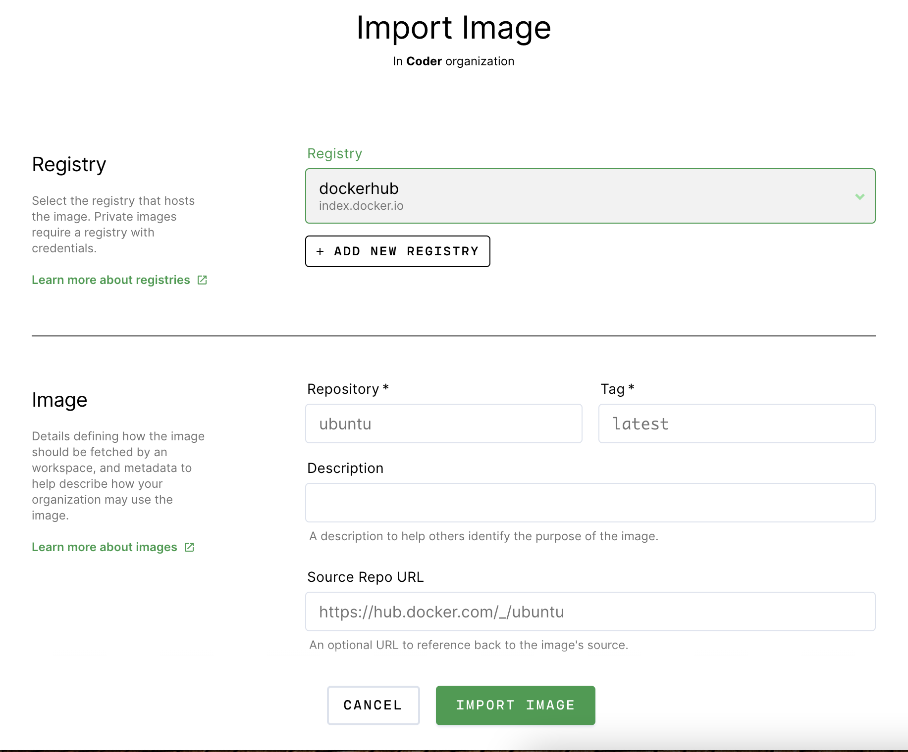

# Import

Coder imports images from [container registries](../admin/registries/index.md).

Images are associated with the same organization as the user who imported it.
For example, if Jessie Lorem is a member of the ExampleCo organization, any
images that they import will also be associated with the ExampleCo organization.

> Any user may import images, but only site managers can link the container
> registry that holds the images.

## Import an image

To import an image:

1. Log into Coder and navigate to **Images > Import Image**.
1. Select the **registry** that hosts your image.
1. Provide your image's **repository** name and **tag**. Optionally, you can
   provide a **description** of the image (this is shown to all users) and a
   **Source Repo URL** to point to the image's source.
1. Specify the minimum amount of resources (cores, memory, and disk space) the
   workspace should have when using this image.
1. Click **Import Image**.

