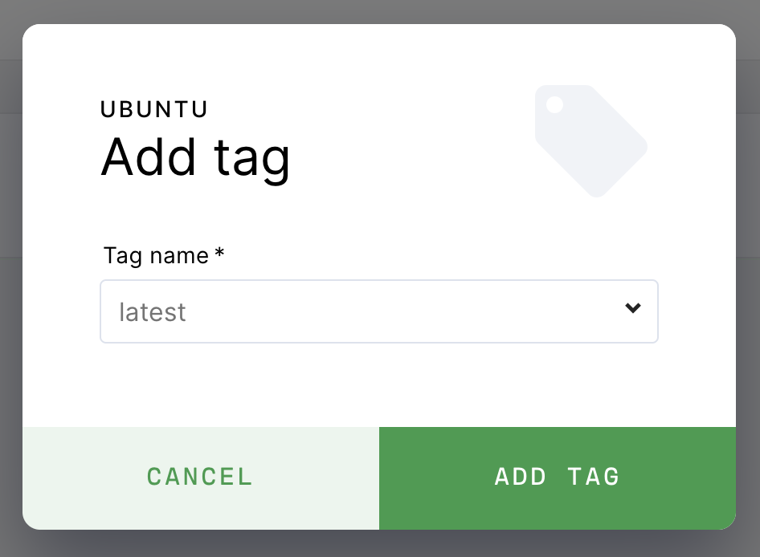

# Tags

<a href="https://docs.docker.com/engine/reference/commandline/tag/"
target="_blank" rel="noreferrer noopener">Image tags</a> are variants of the
original (or base) image. Users can publish new image tags containing updated
dependencies and tooling useful for work on the project.

## Add a tag

To add a tag to Coder:

1. Go to **Images** and find the original image.
1. Open the image, then click **Add Tag** in the top-right.
1. Provide the **tag name** when prompted.

When someone publishes a new version of a tag, Coder notifies users of that tag
with active workspaces.

## Default tag

Each image has a default tag. The default tag appears at the top of the list and
is indicated by an asterisk. Coder automatically selects the default tag when
you create a workspace.

> For information about how Coder handles image tags, see
> [Image Tag Names](../guides/admin/image-tag-names.md).

### Changing the default tag

> We encourage you to update an image's default tag whenever you publish new
> tags since Coder suggests the default tag whenever someone creates a new
> workspace. This change does not affect existing workspaces.

When adding a tag, check **Set tag as default** to make it the default tag for
that image.

To use an existing tag as the default tag, click the **vertical ellipsis** for a
tag and select **Make default**.

