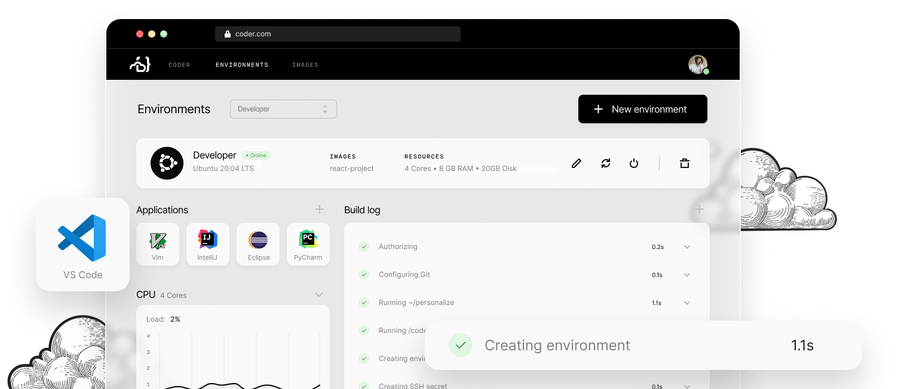

Coder moves software development to your cloud, centralizing
an organization's development initiatives and unlocking substantial
gains in both developer velocity and enterprise security.

  

  <h2>Workflow</h2>

  

    Learn all the tips and tricks to maximize your productivity with Coder.
  

  <a href="./workflow/getting-started/index.md">
    <button class="arrow">
      Get Started
    </button>
  </a>

  <ul>
    <li><a href="./workflow/personalization.md">Personalization</a></li>
    <li><a href="./workflow/ports.md">CLI</a></li>
    <li><a href="./workflow/editor/index.md">Editors</a></li>
    <li><a href="./workflow/ssh.md">SSH</a></li>
  </ul>
  

  

  

  <h2>Administration</h2>

  

    Learn how to leverage Coder for your team.
  

  <a href="./workflow/getting-started/index.md">
    <button class="arrow outlined">
      Learn More
    </button>
  </a>

  <ul>
    <li>Environments</li>
    <li>Resources</li>
    <li>Integrations</li>
  </ul>
  

  

  <h2>Setup</h2>

  

    Learn how to manage your Coder deployment.
  

  <a href="./workflow/getting-started/index.md">
    <button class="arrow outlined">
      Deploy Now
    </button>
  </a>

  <ul>
    <li>Architecture</li>
    <li>Requirements</li>
    <li>Configuration</li>
    <li>Updates</li>
  </ul>
  

