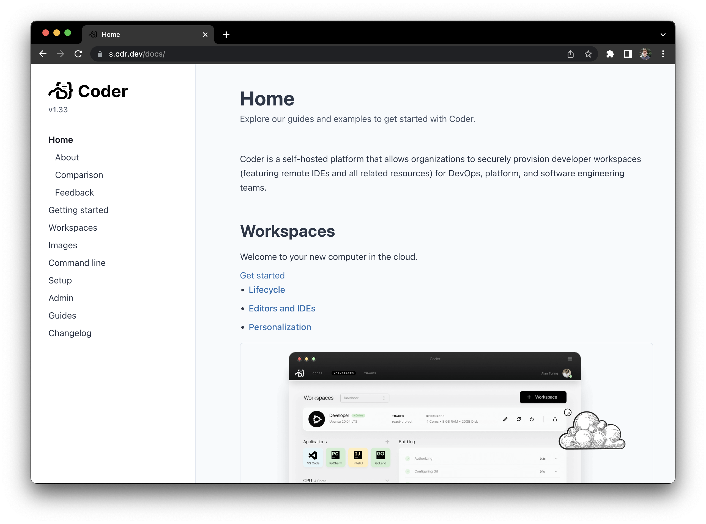
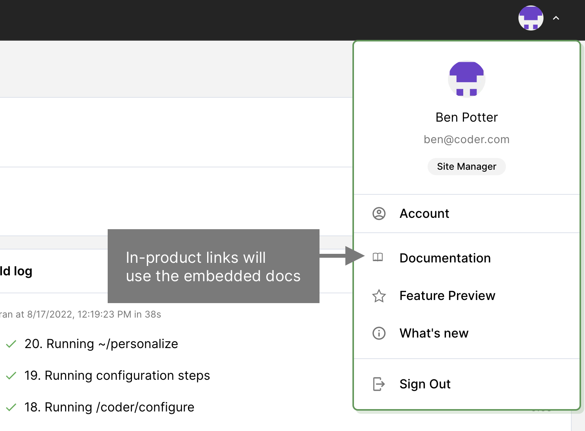

While Coder's documentation is hosted at <https://coder.com/docs/coder>, you can
also access it directly via the Coder deplopyment. This may come in handy if
users are connecting via a network without access to `coder.com`.



By default, in-product documentation links will link to `coder.com`. To change
the links to the offline documentation, you can
[upgrade Coder](../upgrade/index.md) with the following Helm value:

```yaml
coderd:
  extraEnvs:
    - name: USE_OFFLINE_DOCS_LINKS
      value: "true"
```


