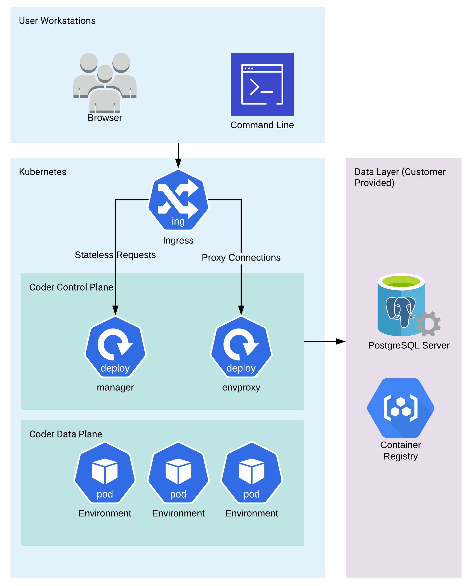

Coder is deployed on Kubernetes and includes the following components:

- **Manager**: the central authority; provides authentication and supports the
  Dashboard and an API which you can use to create and interact with Workspaces
- **Envproxy**: the WebSocket proxy to a workspace's editor and terminal
- **PostgreSQL**: data storage for session tokens, workspace information, etc.

Each component runs in its own Kubernetes pod.

## Kubernetes NGINX ingress

Coder deploys an NGINX Kubernetes ingress controller to allocate and route
requests to the appropriate service. You can disable this controller in the helm
chart if you use your ingress or gateway.

## Ports

The following is a table of the listening ports associated with Coder resources
in the cluster. The environment ports are:

- code-server: `13337`
- envagent (used for shell sessions): `26337`
- envagent (SSH proxy): `12212`

> **Note**: This table represents Coder's current behavior. It is subject to
> change in future releases.

<table>
      <tr>
         <th>Pod</th>
         <th>Source</th>
         <th>Source port</th>
         <th>Destination</th>
         <th>Destination port</th>
      </tr>
      <tr>
         <td rowspan="4">coderd</td>
         <td>loadbalancer</td>
         <td>8080</td>
         <td>envproxy</td>
         <td>N/A</td>
      </tr>
      <tr>
         <td>envproxy</td>
         <td>8080</td>
         <td>dashboard</td>
         <td>N/A</td>
      </tr>
      <tr>
         <td>dashboard</td>
         <td>8080</td>
         <td>resource</td>
         <td>N/A</td>
      </tr>
      <tr>
         <td>N/A</td>
         <td>N/A</td>
         <td>loadbalancer</td>
         <td>80, 443</td>
      </tr>
      <tr>
         <td rowspan="3">envproxy</td>
         <td>loadbalancer</td>
         <td>8080</td>
         <td>coderd</td>
         <td>8080</td>
      </tr>
      <tr>
         <td>N/A</td>
         <td>N/A</td>
         <td>dashboard</td>
         <td>N/A</td>
      </tr>
      <tr>
         <td>N/A</td>
         <td>N/A</td>
         <td>resource</td>
         <td>13337, 12212, 26337</td>
      </tr>
      <tr>
         <td rowspan="3">dashboard</td>
         <td>loadbalancer</td>
         <td>3000</td>
         <td>coderd</td>
         <td>8080</td>
      </tr>
      <tr>
         <td>N/A</td>
         <td>N/A</td>
         <td>envproxy</td>
         <td>N/A</td>
      </tr>
      <tr>
         <td>N/A</td>
         <td>N/A</td>
         <td>resource</td>
         <td>N/A</td>
      </tr>
      <tr>
         <td rowspan="3">resource</td>
         <td>envproxy</td>
         <td>13337</td>
         <td>loadbalancer</td>
         <td>80, 443</td>
      </tr>
      <tr>
         <td>envproxy</td>
         <td>26337</td>
         <td>N/A</td>
         <td>N/A</td>
      </tr>
      <tr>
         <td>envproxy</td>
         <td>12212</td>
         <td>N/A</td>
         <td>N/A</td>
      </tr>
<table>

## Deployment options

There are two ways to deploy Coder:

1. The default installation, which is a non-air-gapped option, using the
   Kubernetes provider of your choice; you should be able to access Coder
   resources from this workspace freely
1. A secured, air-gapped option; you can choose to limit access and deploy Coder
   by first pulling in all of the required resources, or you can choose to
   whitelist the URLs/IP addresses needed to access Coder resources

> Coder cannot be deployed in an air-gapped workspace when using the free
> license tier. If you need to deploy an air-gapped Coder instance, please
> [contact our sales department](mailto:sales@coder.com) to see about purchasing
> licenses.
