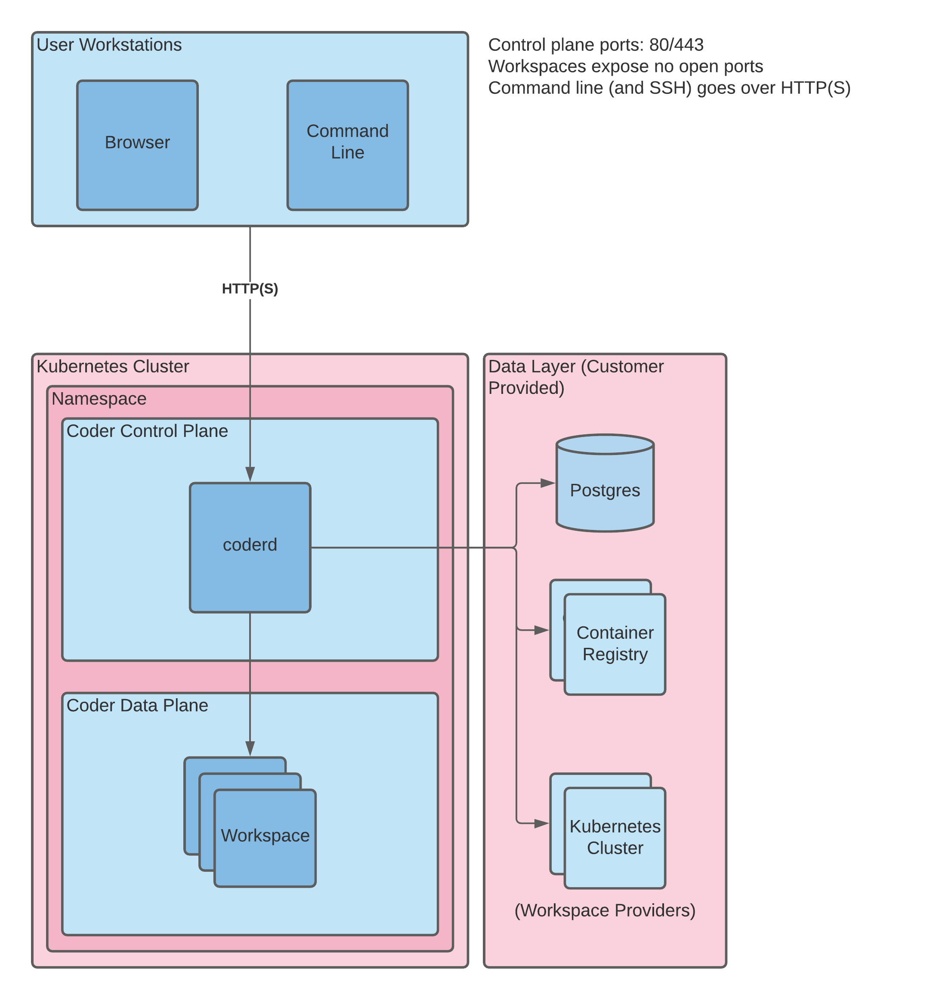

# Architecture

Coder is deployed on Kubernetes and includes the following components:

- **coderd**: the central authority; provides authentication and supports the
  Dashboard and an API which you can use to create and interact with Workspaces
- **PostgreSQL**: data storage for session tokens, workspace information, etc.
- **coder agent**: a program running in each workspace that connects to `coderd`
  and handles tunnelled connections, collection of workspace statistics (such as
  processor and memory utilization), and manages programs, such as editors.

Each component runs in its own Kubernetes pod.

## Deployment options

There are two ways to deploy Coder:

1. The default installation, which is a non-air-gapped option, using the
   Kubernetes provider of your choice; you should be able to access Coder
   resources from this workspace freely
1. A secured, air-gapped option; you can choose to limit access and deploy Coder
   by first pulling in all of the required resources, or you can choose to
   whitelist the URLs/IP addresses needed to access Coder resources

> Coder cannot be deployed in an air-gapped workspace when using the free
> license tier. If you need to deploy an air-gapped Coder instance, please
> [contact our sales department](mailto:sales@coder.com) to see about purchasing
> licenses.
