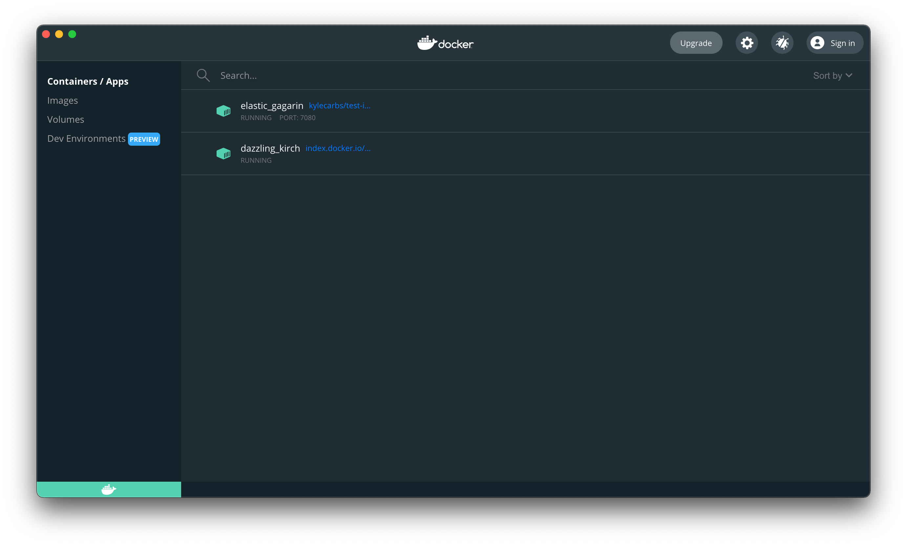
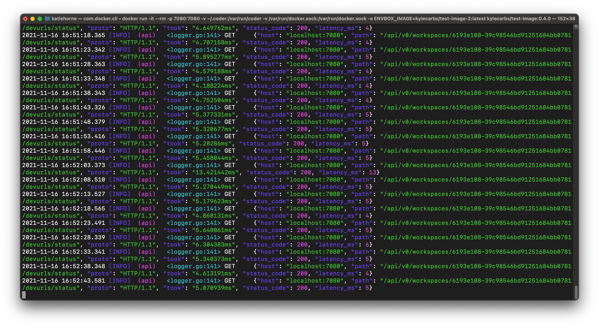

Coder for Docker allows you to deploy Coder to any machine on which Docker runs
quickly.

## Prerequisites

Coder for Docker works with the following platforms:

- macOS 10.10+ with
  [Docker Desktop 20.10](https://www.docker.com/products/docker-desktop)

  **Note**: If your computer uses an [Apple silicon] processor, you will need to
  install [Rosetta 2] to emulate the x86_64 instruction set. To install it, run
  the following command in a terminal window:

  ```console
  softwareupdate --install-rosetta
  ```

- Ubuntu Linux 20.04 (Focal Fossa) with Docker Community Edition 20.10
- Windows 11 with
  [Docker Desktop 20.10](https://www.docker.com/products/docker-desktop).

  **Note**: Coder for Docker requires Windows Subsystem for Linux at this time.

[apple silicon]: https://en.wikipedia.org/wiki/Apple_silicon
[rosetta 2]: https://support.apple.com/en-us/HT211861

> At this time, Coder publishes builds for the x86-64 architecture only and does
> _not_ support Arm-based processors, such Apple silicon or Amazon Graviton
> instances.

## Installing Coder for Docker

1. Launch Docker Desktop.

1. If you've previously installed Coder, run `sudo rm -rf ~/.coder` in the
   terminal. **Note:** This command erases your Coder database and settings, so
   only run this if you'd like a clean install.

1. In the terminal, run the following to download the resources you need,
   including the images, and set up your Coder deployment (if you're using the
   terminal in Docker Desktop, omit the slashes and run as a single-line
   command):

   ```console
   docker run --rm -it \
      -p 7080:7080 \
      -v /var/run/docker.sock:/var/run/docker.sock \
      -v ~/.coder:/var/run/coder \
      codercom/coder:1.30.0
   ```

   When this process is complete, Coder will print the URL you can use to access
   your deployment, as well as the admin credentials you'll need to log in:

   ```console
   > Welcome to Coder! 👋
   > Head to http://localhost:7080 to get started!

   > 🙋 Username: admin
   > 🔑 Password: 5h...7n
   ```

   Make a note of these values, because you will need these in the subsequent
   step.

1. Launch a web browser and navigate to the URL provided by Coder (e.g.,
   `http://localhost:7080`). Log in using the credentials Coder provided.

1. [Create a workspace](../workspaces/create.md) using one of the **Packaged**
   images by clicking on **New workspace** in the center of the UI.

At this point, you're ready to use your workspace. See our
[getting started guide](../getting-started/docker.md) for detailed instructions
on getting your first workspace up and running.

## Usage notes

When running, Docker Desktop displays both your Coder deployment and your
workspace.



You can also view runtime information (i.e., API calls) in the console where you
started your deployment:



## Dev URLs

To use a dev URL, set an environment variable when issuing the `docker run`
command to start your deployment (be sure to replace the placeholder URL):

```console
DEVURL_HOST="*.mycompany.com"
```

For example:

```console
docker run --rm -it -p 7080:7080 -v /var/run/docker.sock:/var/run/docker.sock -v ~/.coder:/var/run/coder -e DEVURL_HOST="*.mycompany.com" codercom/coder:1.30.0
```

## Use an external PostgreSQL database

Coder for Docker comes with an embedded database, but you can
[opt for an external database](postgres.md) instead.

## Admin password

If you want to set (or reset) your admin password, use the
`-e SUPER_ADMIN_PASSWORD=<password>` flag with the `docker run` command.

## Scaling

Coder for Docker is limited by the resources of the machine on which it runs. We
recommend using Kubernetes or AWS EC2 providers if you would like automatic
multi-machine scaling.

For organizations, we recommend one Docker host per team of 5-10 developers.

## Docker Compose

You can also use [Docker Compose](https://docs.docker.com/compose/) to run Coder
in Docker.

To do so:

1. Create a new directory (we recommend something like `c4d`, but you can name
   it whatever you'd like)
1. Within the newly created directory, create a file named `docker-compose.yml`
   that includes the following:

   ```yaml
   version: "3.5"
   services:
   coder:
     image: docker.io/codercom/coder:1.30.0
     container_name: coderd
     restart: unless-stopped
     ports:
       - 7080:7080/tcp
     volumes:
       - /var/run/docker.sock:/var/run/docker.sock
       - ${HOME}/.coder:/var/run/coder
   ```

1. In the terminal, navigate into the folder you created and run:

```console
docker-compose up -d
```

Coder will now run in the background.

For more detailed information on the Docker Compose file, please see
[Docker's docs](https://docs.docker.com/compose/compose-file/compose-file-v3/).

## Coder templates

You can use
[templates](https://coder.com/docs/coder/latest/workspaces/workspace-templates/templates#workspace-template-sample)
with Coder for Docker to define how Coder builds your workspaces.

To use a standard Coder workspace template for Docker:

1. Change the `workspace.type` and`workspace.specs` to `docker`
1. Remove any Kubernetes-specific `workspace.specs.kubernetes values` (e.g.,
   `cpu`, `memory`, `gpu`)

Your configuration file will look something like the following:

```yaml
version: 0.2
workspace:
  type: docker
  specs:
    docker:
      image:
        value: index.docker.io/codercom/enterprise-intellij:ubuntu
      container-based-vm:
        value: false
  configure:
    start:
    ...
```

## Ensure that user IPs show up in the audit logs

If you would like users' IP addresses to show up in the audit logs (i.e.,
identify the originating client IP address, regardless of whether they're
connecting through a proxy, load balancer, or other such service), use the
following flags with the `docker run` command:

```console
-e "PROXY_TRUSTED_HEADERS=X-Forwarded-For"
-e PROXY_TRUSTED_ORIGINS=172.17.0.0/16
```

## Workspace providers

If you're interested in using Docker as a workspace provider, please see our
[deployment instructions](../../admin/workspace-providers/deployment/docker.md).

## Accessing the local PostgreSQL database

To query the local PostgreSQL database using the `psql`
[terminal-based front-end](https://www.postgresql.org/docs/13/app-psql.html),
follow these steps.

1. Run `docker ps` to get the name of the Coder container.

1. Exec into the Coder container and connect to the database.

```console
docker exec -it <CODER_CONTAINER> psql --username=coder --host=0.0.0.0 --port=5433 --dbname=postgres
```

## Known issues

Currently, Coder for Docker does not support:

- The use of your own TLS certificates. If you'd like to use TLS with Coder for
  Docker, you'll need to run Coder behind a reverse proxy (e.g., Caddy or NGINX)
  and terminate TLS at that point. See
  [our guide](../../guides/tls-certificates/docker-tls.md) for information.
- Air-gapped deployments/offline installs
