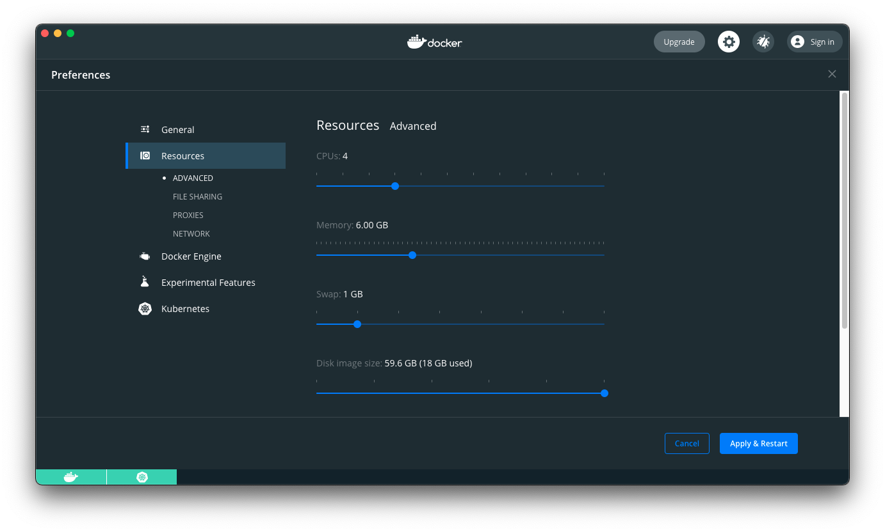

Coder is typically deployed to a remote data center, but you can use
[Docker][docker-url] to create a lightweight preview deployment of Coder.

> Coder currently supports local preview only on workstations running macOS or
> Linux.

Coder automatically uploads a single-seat license upon installation.

## Prerequisites

Before proceeding, please make sure that you have the following installed:

1. [Docker](https://hub.docker.com/search?q=docker&type=edition&offering=community)
1. [helm](https://helm.sh/docs/intro/install)
1. [kind](https://kind.sigs.k8s.io/docs/user/quick-start/#installation) or
   [Docker Desktop](docker-desktop-url)
1. [kubectl](https://kubernetes.io/docs/tasks/tools/install-kubectl)

## Limitations

**We do not recommend using local previews for production deployments of
Coder.**

### Resource allocation and performance

Your experience with the local Coder preview is dependent on your system specs,
but please note that you can expect slightly degraded performance due to the
deployment running entirely inside a Docker container.

### CVMs

The kind deployment supports [CVMs][cvm-url] if you meet the following
requirements (if you choose not to try out CVMs, these requirements do not
apply):

1. Your Linux hosts must be running Linux Kernel 5 and above.

1. You must have the `linux-headers` package corresponding to your Kernel
   version installed. You should see the following folders all corresponding to
   your Kernel version:

   ```console
   $ uname -r
   5.11.4-arch1-1
   $ ls /usr/lib/modules
   5.11.4-arch1-1
   $ ls /usr/src/
   linux  linux-headers-5.11.4-arch1-1
   ```

1. Docker Desktop for Mac **must** use version [2.5.0.1][docker-mac-url]. This
   specific version is required because of a recent downgrade to Linux Kernel
   4.9 due to a [bug][docker-bug-url].

### SSH

When using kind for your local preview, SSH is not configured to run by default.

When using Docker Desktop for your local preview, SSH works as long as your
machine does not have an existing SSH server running on port `22`.

### Air-gapped clusters

The local preview option does not work in an air-gapped deployment.

## Option 1: Kind

The kind install script currently installs Coder v1.18.1 and is currently
incompatible with Coder v1.21. To install Coder, run:

```console
curl -fsSL https://coder.com/try.sh | PORT="80" sh -s --
```

> Note: you can edit the value of `PORT` to control where the Coder dashboard
> will be available. However, dev URLs will only work when `PORT` is set to
> `80`.

When the installation process completes, you'll see the URL and login
credentials you need to access Coder:

```txt
You can now access Coder at

    http://localhost:80

You can tear down the deployment with

    curl -fsSL https://coder.com/try.sh | sh -s -- down

Platform credentials
User:     admin
Password: yfu...yu2
```

Visit the URL, and log in using the provided credentials.

### Dev URLs

Coder allows you to access services you're developing in your workspace via
[dev URLs](../../workspaces/devurls.md). You can enable dev URLs after you've
installed Coder.

> If you do not want to enable dev URLs, you can use SSH port forwarding or
> tools like [ngrok][ngrok-url] to preview webpages from inside you workspace.

1. To use dev URLs, you must have a wildcard subdomain. One option to meet this
   requirement is to use a service such as [nip.io][nip-url] to route domains to
   a local IP address.

1. [Update Coder](../updating.md#update-coder) with the following Helm values
   added for either your local (`127.0.0.1`) or private (e.g., `192.168.1.x`)
   address:

   ```yaml
   ingress:
   host: "127.0.0.1.nip.io"
   devurls:
   host: "*.127.0.0.1.nip.io"
   ```

Alternatively, you can use [dnsmasq][dnsmasq-url] to create local domains (e.g.,
`http://dashboard.coder` and `http://*.coder`). This may be useful if you do not
want to rely on an external service/network or if your network has DNS rebinding
protection. Here's how to do this:

1. Install dnsmasq

   ```console
   # Mac OS
   brew install dnsmasq

   # Linux (Ubuntu)
   sudo apt-get install dnsmasq
   ```

1. Create a dnsmasq configuration for the `.coder` domain

   ```console
   # Mac OS
   sudo touch $(brew --prefix)/etc/dnsmasq.d/coder.conf
   sudo vim $(brew --prefix)/etc/dnsmasq.d/coder.conf

   # Linux (Ubuntu)
   sudo touch /etc/dnsmasq.d/coder.conf
   sudo vim /etc/dnsmasq.d/coder.conf
   ```

   ```text
   # coder.conf
   address=/coder/127.0.0.1
   ```

1. Add dnsmasq as DNS resolver on your machine

   ```console
   # Mac OS: this will only route
   # .coder domains to dnsmasq
   sudo mkdir -p /etc/resolver
   sudo touch /etc/resolver/
   sudo vim /etc/resolver/coder

   # Linux (Ubuntu)
   # add to top of the file
   sudo vim /etc/resolv.conf
   ```

   ```text
   nameserver 127.0.0.1
   ```

1. [Update Coder](../updating#update-coder) with these Helm values added to use
   your new domains:

   ```yaml
   ingress:
   host: "dashboard.coder"
   devurls:
   host: "*.coder"
   ```

## Option 2: Docker Desktop

[Docker Desktop](docker-desktop-url) includes a standalone Kubernetes server and
client that you can use to run Coder.

1. [Enable the Kubernetes cluster](docker-k8s-docs) inside Docker.

1. Ensure that Docker has enough resources allocated to meet
   [Coder's requirements](https://coder.com/docs/coder/v1.20/setup/requirements)
   (you can do so by going to Docker preferences).

   

1. Install [metrics-server](https://github.com/kubernetes-sigs/metrics-server)
   so that Coder gets valid metrics from your cluster:

   ```console
   helm repo add bitnami https://charts.bitnami.com/bitnami
   ```

1. [Install Coder](../installation) on to your cluster.

If you run into `OutOfmemory` errors when installing, try increasing your
resource allocation in Docker. If increasing the resource allocation doesn't fix
the error, reinstall Coder using the following Helm values:

```console
helm upgrade --install coder \
    coder/coder
```

> Note: For Coder versions v1.21+, you will need to update your access URL (in
> Manage > Admin) to your private IP address (e.g `192.168.1.x`) instead of
> localhost.

## Removing Coder

To remove the local Coder deployment, run:

```console
curl -fsSL https://coder.com/try.sh | sh -s -- down
```

Because Coder runs inside Docker, you should have nothing left on your machine
after tear down.

If you added a custom DNS to use [dev URLs](#dev-urls), you can revert these
changes by uninstalling dnsmasq and removing the resolver config:

```console
# MacOS
brew remove dnsmasq
sudo rm -r /etc/resolver/coder

# Linux (Ubuntu)
sudo apt-get remove dnsmasq
sudo vim /etc/resolv.conf
# remove "nameserver 127.0.0.1"
# and ensure you have another
# nameserver specified
# e.g "nameserver 127.0.0.53"
```

[docker-url]: https://www.docker.com/
[dnsmasq-url]: https://linux.die.net/man/8/dnsmasq
[docker-desktop-url]: https://www.docker.com/products/docker-desktop
[docker-k8s-docs]: https://docs.docker.com/desktop/kubernetes/
[kind-url]: https://kind.sigs.k8s.io/
[cvm-url]: https://coder.com/docs/workspaces/cvms
[docker-mac-url]:
  https://docs.docker.com/docker-for-mac/release-notes/#docker-desktop-community-2501
[docker-windows-url]:
  https://docs.docker.com/docker-for-windows/release-notes/#docker-desktop-community-2501
[docker-bug-url]: https://github.com/docker/for-mac/issues/5044
[ngrok-url]: https://ngrok.com
[devurl-url]: https://coder.com/docs/workspaces/devurls
[nip-url]: https://nip.io
