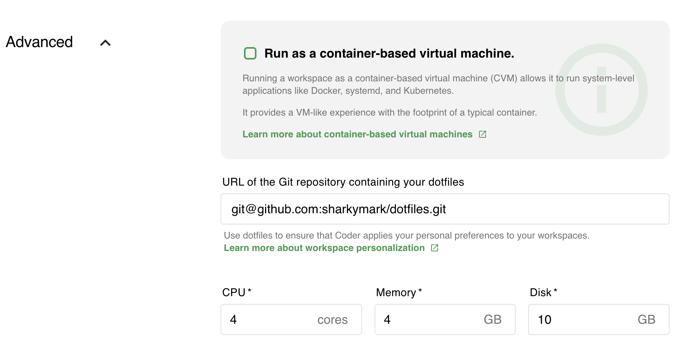

Coder is deployed into a Kubernetes cluster namespace, and we recommend the
following resource allocation minimums to ensure quality performance.

## Compute

See [Scaling](./scaling.md) for more information.

For **each** active developer using Coder, allocate additional resources. The
specific amount required per developer varies, though we recommend starting with
4 CPUs and 4 GB of RAM, especially when JetBrains IDEs are used and which are
CPU and memory intensive. Developers are free to request the resource allocation
that fits their usage:

We also recommend [monitoring](../guides/admin/usage-monitoring.md) your usage
to determine whether you should change your resource allocation. Accepting a
utilization of RAM of around 50% and CPU of around 70% is a good way to balance
performance with cost.

## Throughput

We recommend the following throughput:

- Read: 3000 IOPS at 50 MB/s
- Write: 3000 IOPS at 50 MB/s

## Enabled extensions

You must enable the following extensions on your K8 cluster (check whether you
have these extensions enabled by running `kubectl get apiservices`):

- apps/v1
- rbac.authorization.k8s.io/v1
- metrics.k8s.io
- storage.k8s.io/v1
- networking.k8s.io/v1
- extensions/v1beta1

## Browsers

Use an up-to-date browser to ensure that you can use all of Coder's features. We
currently require the following versions _or newer_:

- Apple Safari 12.1
- Google Chrome 66
- Mozilla Firefox 57
- Microsoft Edge 79

If you're using [Remote IDEs](../workspaces/editors.md), allow pop-ups; Coder
launches the Remote IDE in a pop-up window.

## Storage

Coder requires the use of a
[persistent volume](https://kubernetes.io/docs/concepts/storage/persistent-volumes/)
in your Kubernetes cluster to store [workspaces](../workspaces/index.md) data.
More specifically, the persistent volume claim (PVC) requires the block storage
type (the PVC is created when you create the workspace to mount the requested
block storage).

Files stored in the `/home` directory of a workspace are persisted in the PVC.
All files that live _outside_ of the `/home` directory are written to the node's
disk storage (the node's disk storage is shared across all workspaces on that
node). If there's insufficient node disk storage, Coder cannot create new
workspaces (and, in some cases, workspaces may be evicted from the node). To
avoid this, we recommend creating nodes with a disk size of at least 100 GiB.

Additionally, you must enable
[dynamic volume provisioning](https://kubernetes.io/docs/concepts/storage/dynamic-provisioning/#enabling-dynamic-provisioning)
so that Coder can mount the PVC to the workspace (if you're using a custom
`StorageClass`, be sure that it supports DVP. Otherwise, Coder cannot provision
workspaces).

> If you are running a multi-zone deployment, ensure that you have at least
> one node in each zone to prevent volume node affinity conflicts.

## Database

Coder requires a [PostgreSQL](https://www.postgresql.org) database to store
metadata related to your deployment.

By default, Coder deploys a TimescaleDB internal to your Kubernetes cluster.
This is included for evaluation purposes _only_, and it is _not_ backed up. For
production deployments, we recommend using a PostgreSQL database _external_ to
your cluster. You can connect Coder to your external database by
[modifying the Helm chart](../guides/admin/helm-charts.md) with information
regarding your PostgreSQL instance.

Coder requires, at minimum, PostgreSQL 11 with the `contrib` package installed.

## Network Policies

Coder uses
[Kubernetes NetworkPolicies](https://kubernetes.io/docs/concepts/services-networking/network-policies/)
to enforce network segmentation and tenant isolation within your cluster.

Coder's network isolation policy blocks all ingress traffic to workspaces except
traffic from the control plane (this ensures that you can audit all traffic).
However, the control plane does not specify egress rules; by default, it allows
outbound traffic. However, you can still enforce a more specific network policy.

[Container network interface (CNI)](https://github.com/containernetworking/cni#what-is-cni)
plugins implement network segmentation and tenant isolation in the Kubernetes
cluster. They enforce network boundaries between pods, preventing users from
accessing other workspaces.

If your container network interface (CNI) plugin does not support NetworkPolicy
enforcement, traffic between workspaces, and other containerized workloads
within the same cluster will be permitted to communicate without restriction.
Consider testing your container networking _after_ installing Coder to ensure
that the behavior is as expected.

> If you're not sure which CNI plugin to use, we suggest
> [Calico](https://docs.projectcalico.org/getting-started/kubernetes/quickstart).

## Licenses

The use of Coder deployments requires a license that's emailed to you.

### Restrictions

Deployments using the free trial of Coder:

- **Must** be able to reach and use an outbound internet connection (at minimum,
  your deployment must be able to access **licensor.coder.com**)
- Cannot be deployed in an air-gapped network
- Must use Coder v1.10.0 or later

The above requirements do not apply to potential customers engaged in our
evaluation program.
