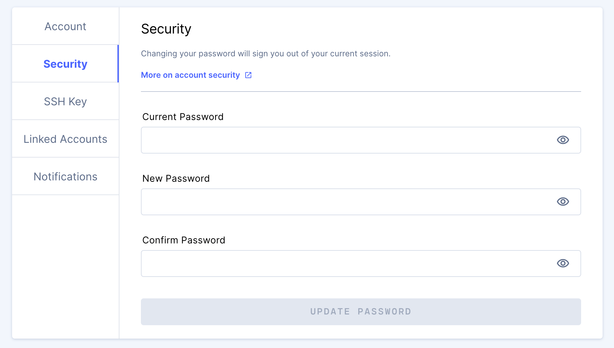

The Security tab allows you to change your password if your organization
utilizes built-in authentication for sign-in (this is the case if you provide an
email address and password to log into Coder).

To change your password, provide your **current password** and what you would
like your **new password** to be. You'll be asked to confirm your new password.

When done, click **update password**.

Please note that changing your password will sign you out of your current
session, and you'll need to sign in again on all devices.

> You cannot change the passwords for accounts authenticated via Open ID Connect
> using Coder. However, your password may be changeable within your
> organization's account management system. See your system administrator for
> additional information.
