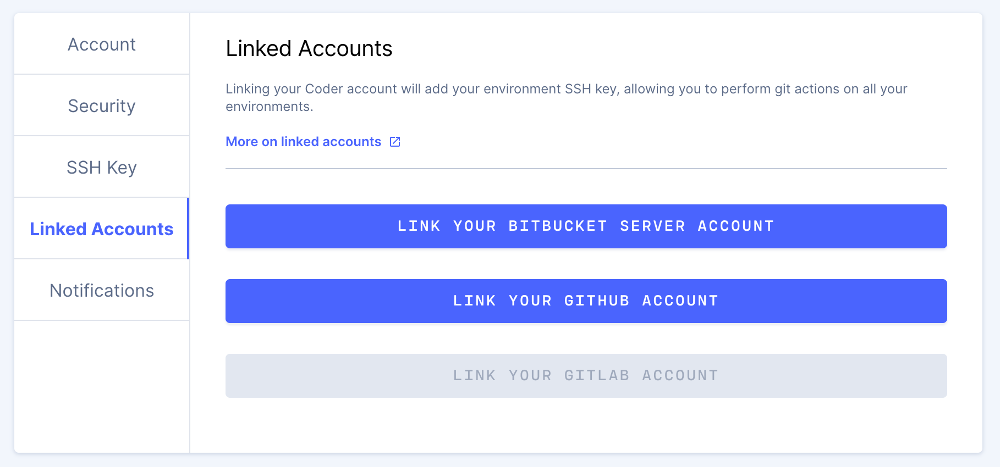

Once your site manager has set up a [Git service](doc:git-service), you can link
your Coder account to a [supported Git service](doc:git-service#support).

Navigate to **Preferences** > **Linked Accounts**, then go through linking
process.

Once you've connected your account, your Coder SSH key will be added to your
provider account. This allows you to use the service (i.e., using the `git
clone` and `git push` commands) without further configuration in your Coder
environment.
