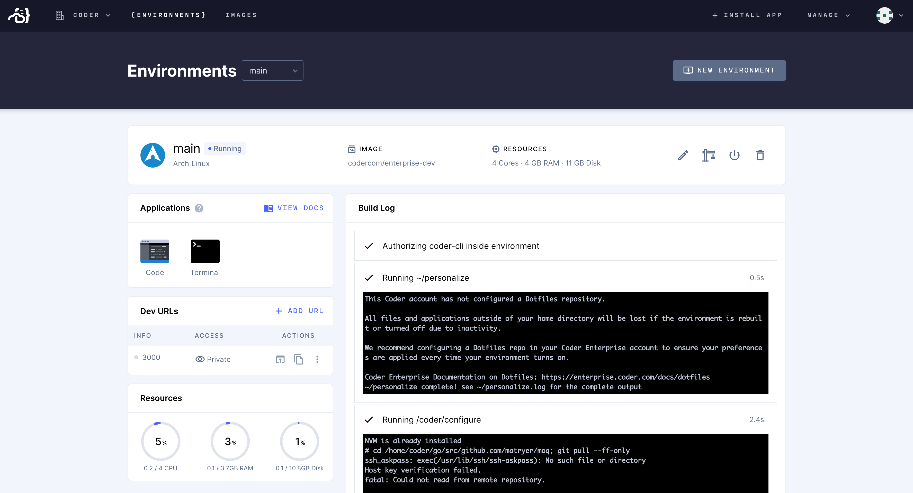

Environments are containers that bundle the dependencies and tooling you need to
contribute to a project. Within the environment, you'll be working with the IDE
of your choice or in the terminal.

All Coder environments are created using [Docker
images](../images/index.md). The images include:

- Language version
- Dependencies
- Any utilities and tooling needed for your project

There may be multiple versions of an image that you can use, each of which is
represented as an image tag.

> Environments can only be accessed by their creator.
