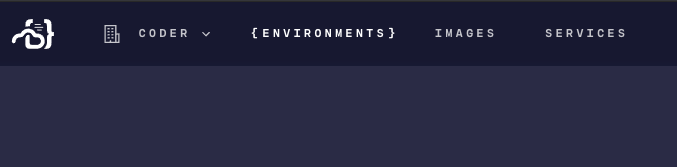
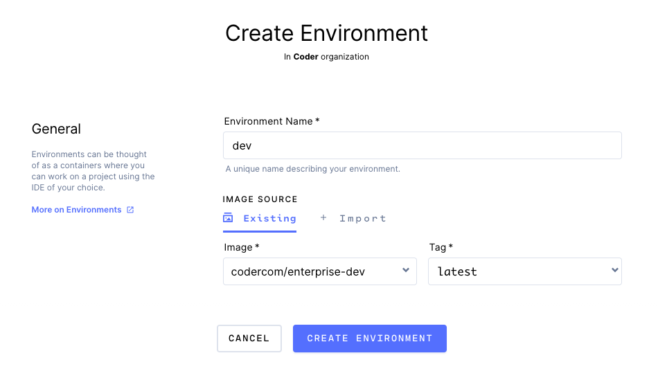

An Environment is your personal computer on {{@product_name}}.

Environments are created from common images that are shared among your team.
By using the same images, you no longer have the "it works on my machine" problem.

When an update is pushed to the Image your Environment uses, you'll be able to rebuild!
Your home directory persists after rebuilds, so feel free to configure to your liking.

1. Navigate to the Environments page.

   

2. Click "New Environment".

   

3. Name your environment, select an image, and click "Create Environment".

   

4. Your environment will start creating... you'll be notified once it finishes!
