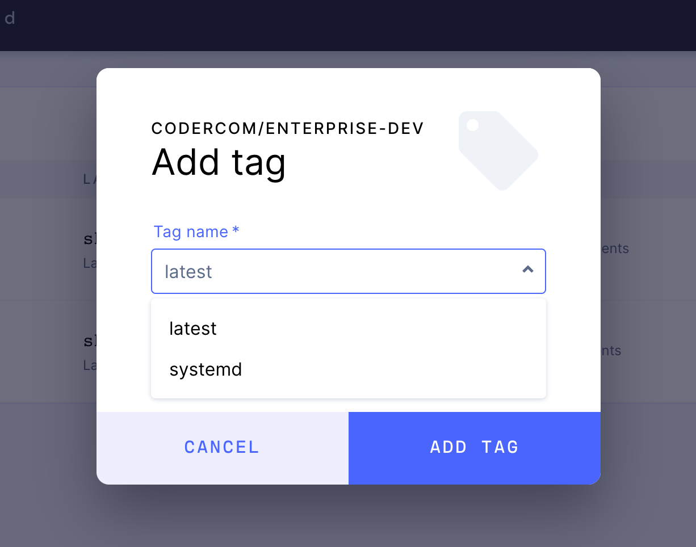
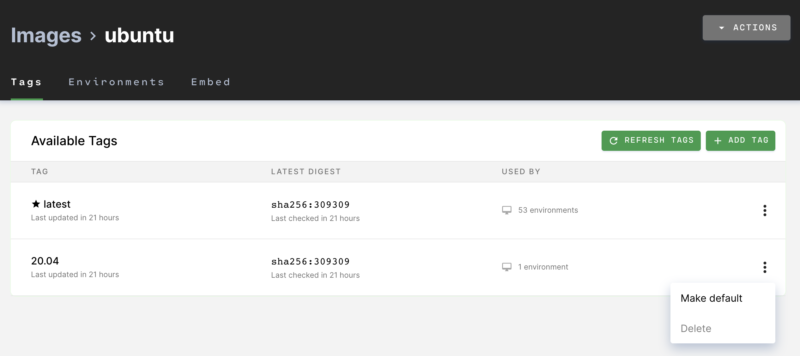

<a href="https://docs.docker.com/engine/reference/commandline/tag/"
target="_blank" rel="noreferrer noopener">Image tags</a> are variants of the
original (or base) image. Users can publish new image tags containing updated
dependencies and tooling useful for work on the project.

To add a tag to Coder, go to **Images** and find the original image. Open the
image, then click **Add Tag** in the top-right. Provide the **tag name** when
prompted.

When someone publishes a new version of a tag, Coder notifies users of that tag
with active environments.

## Default Tag

Each image has a default tag, which appears at the top of the list and is marked
by an asterisk. Coder automatically selects the default tag when you create an
environment.

### Changing the Default Tag

> We encourage you to update an image's default tag whenever you publish new
> tags since Coder suggests the default tag whenever someone creates a new
> environment. This change does not affect existing environments.

When adding a tag, check **Set tag as default** to make it the default tag for
that image.

To use an existing tag as the default tag, click the 3 dot menu for a tag and
select **Make default**.

