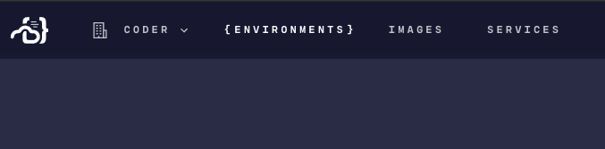

## 1. Login

Navigate to your deployment of Coder and login using your username and password,
or single-sign-on.

## 2. Create Environment

{{#> example}}
{{#> dashboard}}

1. Navigate to the "Environments" page.



2. Click "New Environment".


3. Enter your image, and click create.


{{/dashboard}}
{{#> cli}}

```bash
kyle@local:~$ coder envs create dev --image golang:1.14
```

{{/cli}}
{{/example}}

## 3. Select Editor

<div class="flex-row">
  <div class="card">
    Local VS Code
  </div>
  <div class="card">
    Browser VS Code
  </div>
  <div class="card">
    Browser JetBrains
  </div>
</div>

## 1. Get Authenticated

Navigate to your deployment of Coder and login using your credentials or OIDC provider.

## 2. Local or Remote

Are you trying to use your local editors, or have everything through the browser?

Add some buttons here that say "I'm using local VS Code", "I'm using VS Code
through the browser", "I'm using JetBrains through the browser", "I'm using
JetBrains locally" should link to a help article.

## 3. VS Code or JetBrains

## 3. Editors
