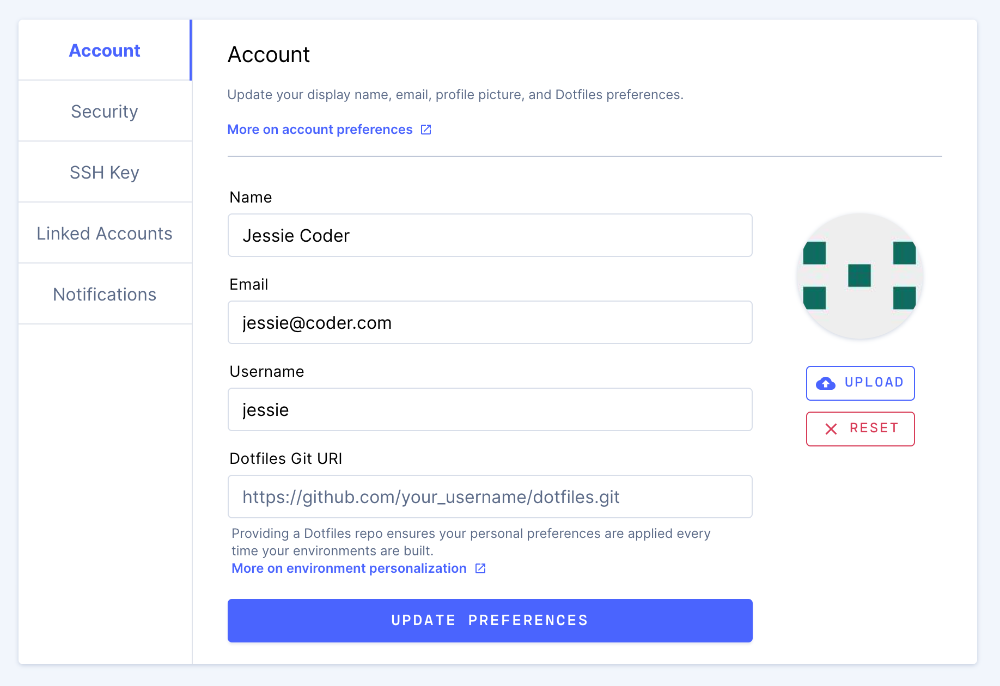

The **Account** tab allows you to update your name, email, username, and profile
picture. You can also provide a link to your dotfiles repository to
[personalize](../personalization.md) your Coder environments.

## Name and Email

You can change your **name**, **email**, or **username** at any time.

## Profile Photo

You can upload a profile photo that's visible to you and your teammates on
Coder. Coder crops your photos to **512px by 512px** and converts them to JPEG.
