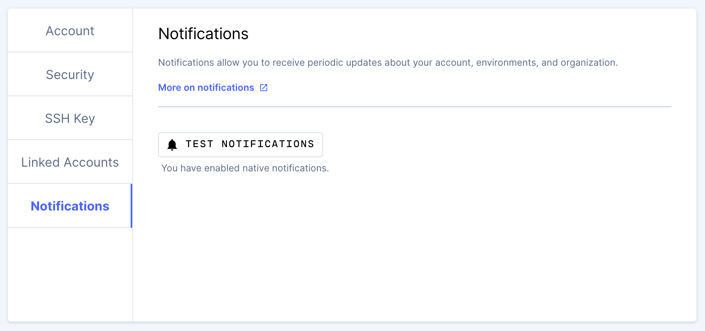

You can allow Coder to display native notifications, which allows you to focus
on a different window or view a different page yet receive alerts when
necessary.

Coder issues desktop notifications when you create a new environment, as well as
when you rebuild an existing environment.

Please note that:

- You may not receive native notifications when using your browser's private
  browsing mode
- You must enable native notifications on each browser on which you run Coder

## Testing Notifications

You can see if you have native notifications enabled by clicking **Test
Notifications**.

