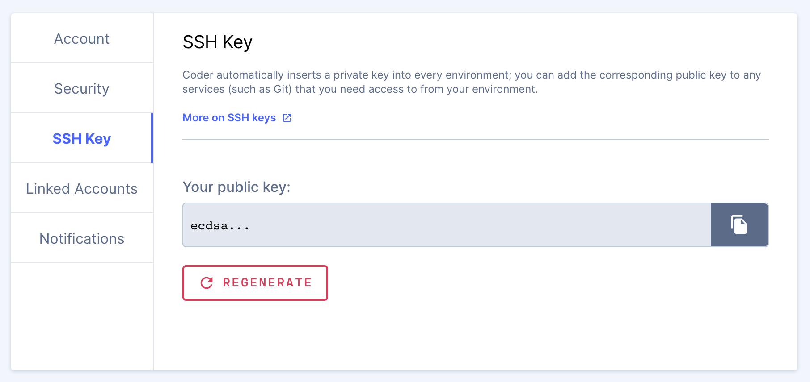

The **SSH Key** tab allows you to download your public SSH key (Coder
automatically inserts a private key into every environment).

You can provide your public key to third-party tools or services (such as Git
and GitHub) so that they can access your Coder environment.

If necessary, Coder allows you to **regenerate** your SSH key. Please note that
this action will invalidate any prior keys created for your environment.
