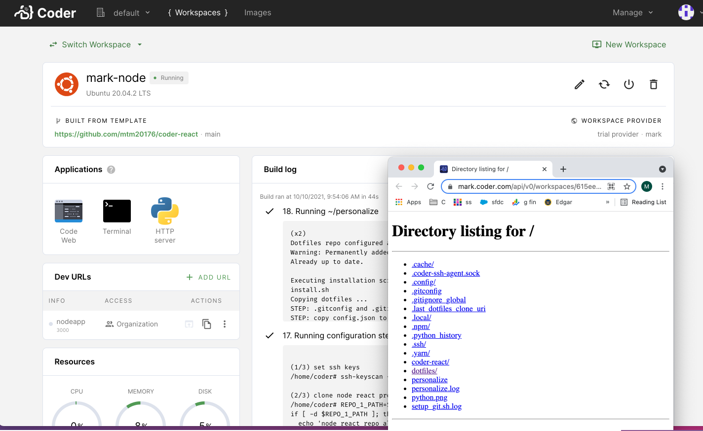

Coder connects developers to web applications installed in their workspaces by
using an applications specification file file located at
`/coder/apps/config.yaml` on the workspace filesystem.



## Application Specification File

You may specify the following options for an application:

```yaml
# /coder/apps/config.yaml

apps:
  # Name of application in launcher
  - name: projector
    # Application scheme
    scheme: http
    # Application port
    port: 9999
    # Working directory
    dir: /home/coder
    # File path to icon used in launcher
    icon_path: /home/coder/goland.svg
    # Command to start the application
    command: /home/coder/.local/bin/projector
    # Array of arguments for command
    args: ["run"]
    # Health checks to get running application status
    # Can use exec or http health checks to localhost
    health_check:
      exec:
        command: "pgrep"
        args: ["projector"]
      http:
        scheme: "http"
        path: "/"
        port: 9999
```

The applications specification file can be written into the workspace image and
also supports editing via [personalization](./personalization.md) scripts.
