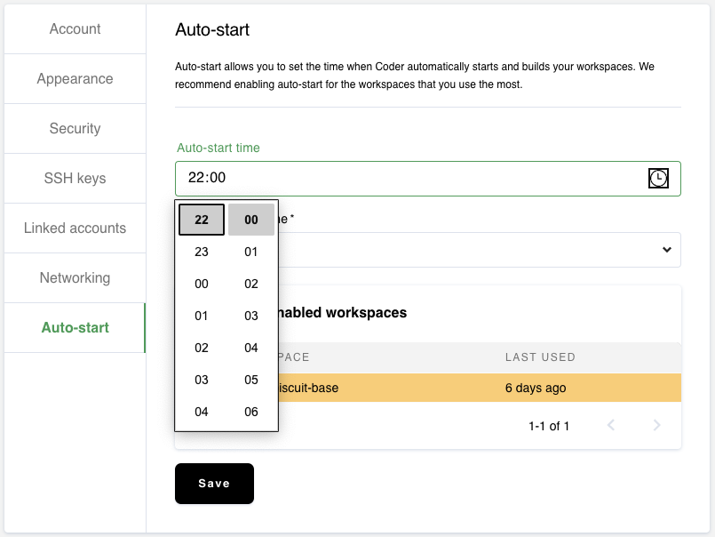
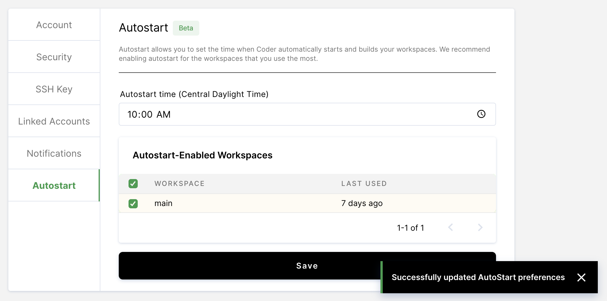

Coder
[automatically turns off idle workspaces](../admin/workspace-management/shutdown.md)
to help manage resource expenditure. Typically, this means workspaces turn off
overnight and remain offline until a rebuild is requested. With Autostart, you
can request automated rebuilds at a time that suits your workflow. You can
expect your workspaces to be ready for you at the start of each workday.

## Criteria for autostart

Your workspace must be:

- Active (_Active_ workspaces are those that have been opened in the last four
  days)
- Off (Autostart doesn't work when workspaces are _on_ to prevent the triggering
  of a rebuild while you're working)

Coder may trigger Autostart up to 5 minutes before your scheduled time to ensure
all queued workspaces are ready on time.

## Enabling autostart

1. Click on your avatar in the top-right and select **Account** in the drop-down
   menu.

1. Select the **Autostart** tab and set your desired Autostart time.

   

1. Select the workspaces for which you want to enable Autostart and save.

   

### Enabling Autostart for new workspaces

When creating a new workspace, you may enable Autostart by checking the box
labeled **Automatically turn this workspace on at (HH:MM)** (where HH:MM is your
configured time).

